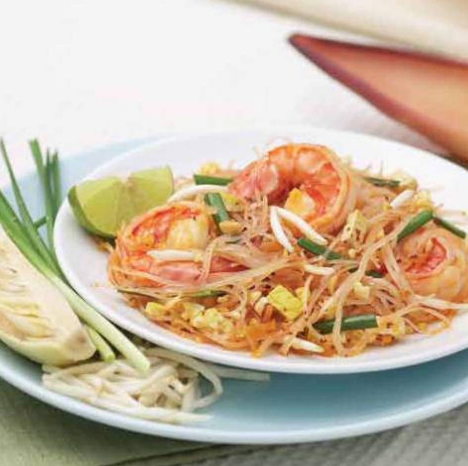
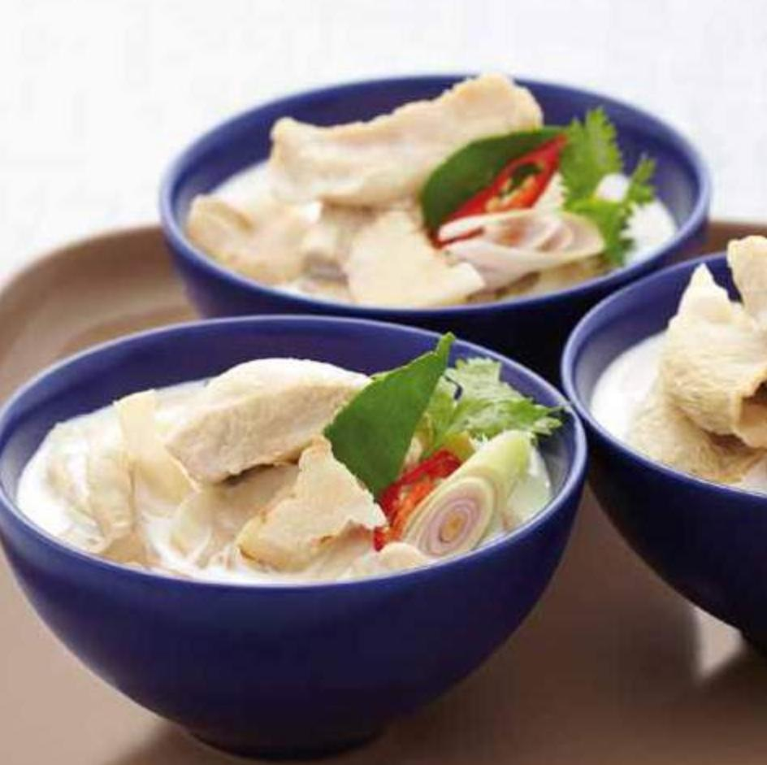
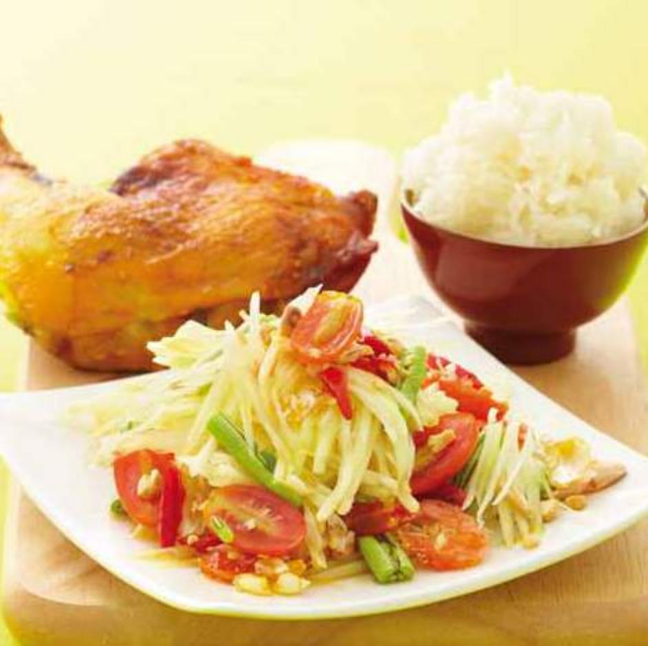
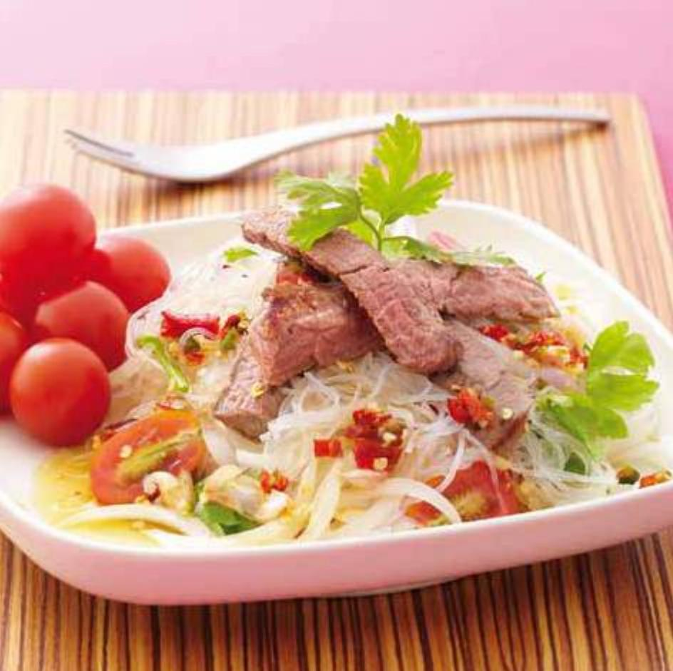
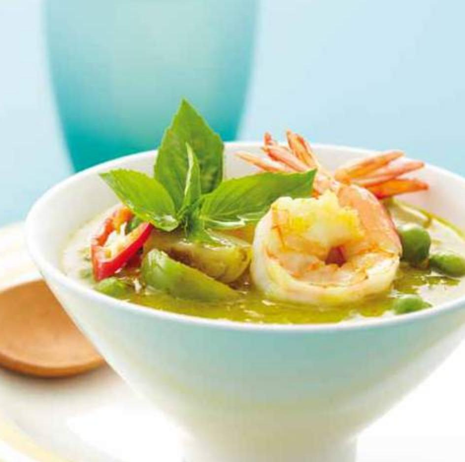
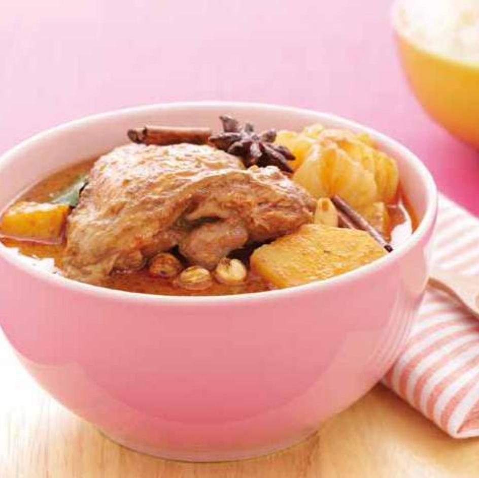
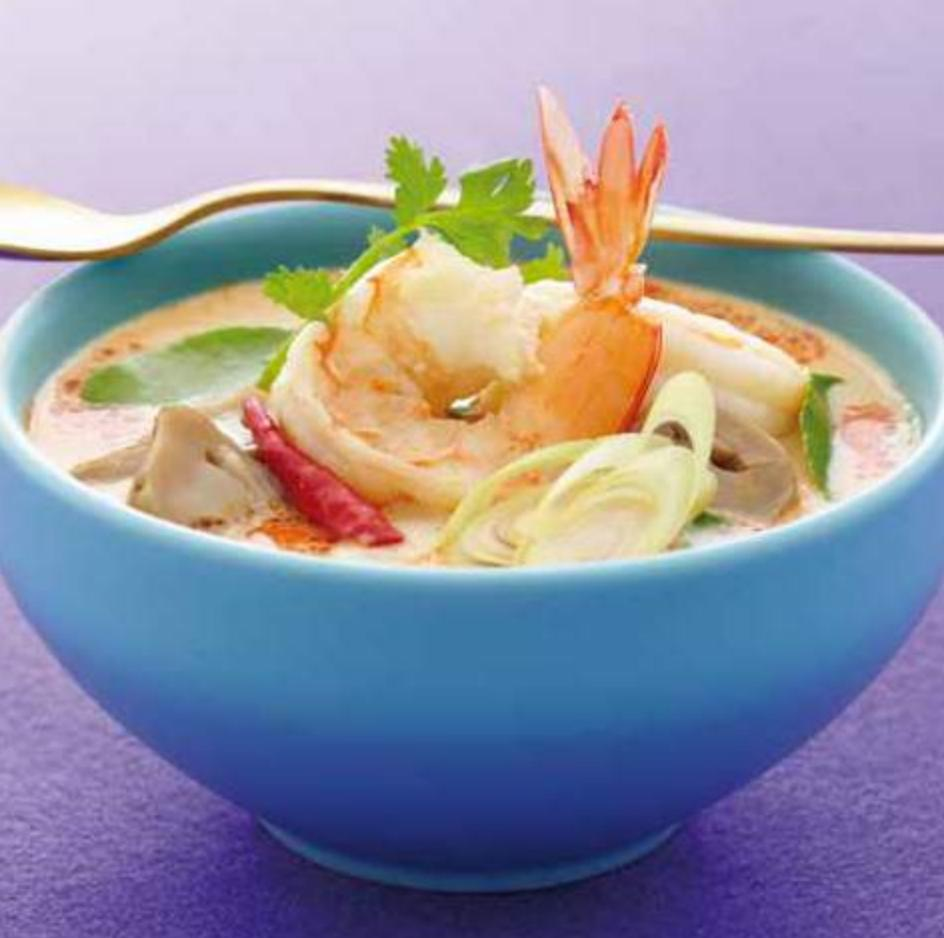
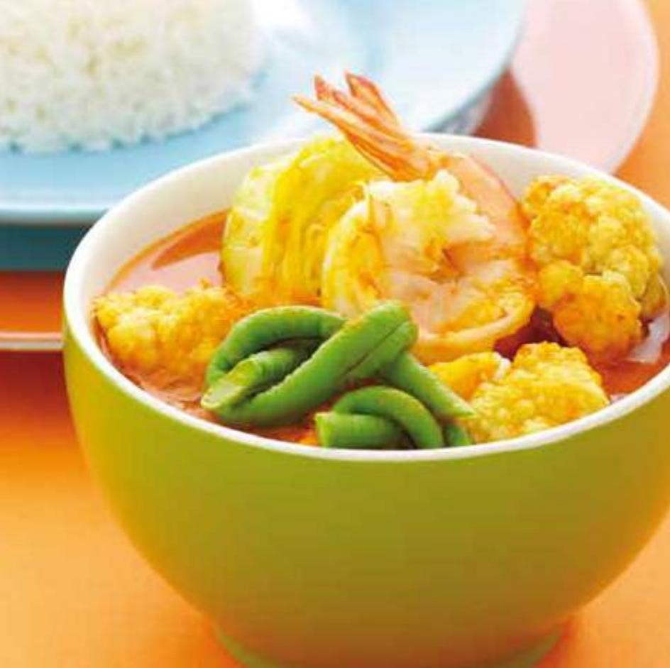
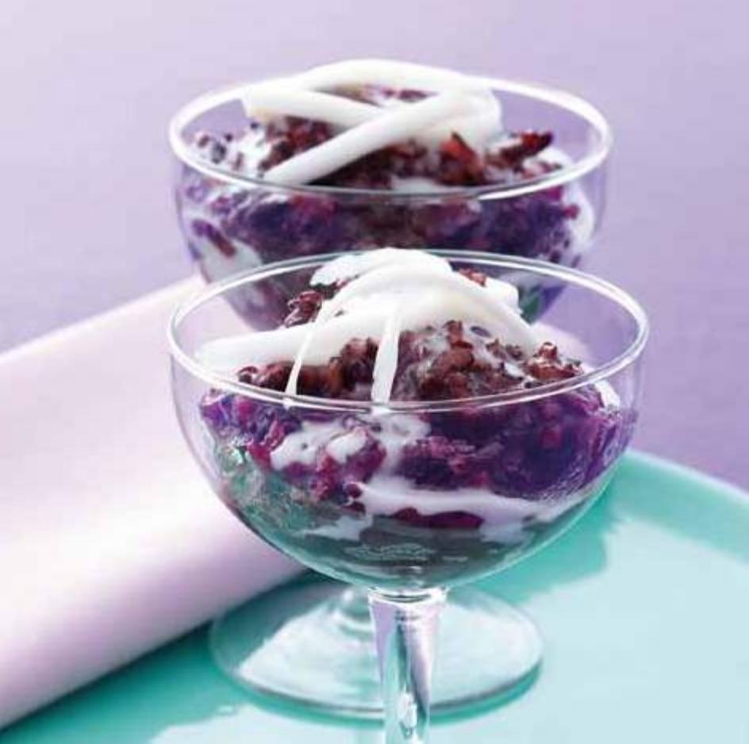

# Thai SELECT

THAI CUISINE

AWARDED BY MINISTRY OF COMMERCE THAILAND

## Thai SELECT Exotic, Healthy, Delicious Dining-Thai Style

Thai food has rapidly grown in popularity among casual diners and gourmets alike, earning it a status as one of the world's most popular cuisines. While most people think of spicy meals laced with chilies as the predominant factor in Thai food, this is far from the truth.

In all Thai dishes, there must always be a balanced harmony of flavors. Whether in a rich or fragrant Thai curry, spicy soup, savory salad, or sweet dessert, the competing and complementing flavors create a harmonious blend that once tasted, will never be forgotten. Herbs and spices are surely the heart of a meal, for it is these ingredients that provide a dazzling array of delicious and exotic tastes that make Thai cuisine so distinct. In addition to chili, it is common to find garlic, lemongrass, basil, mint, and other herbs and spices used in Thai cooking.

The following popular Thai menus can be found in Thai restaurants worldwide. For a proper Thai culinary experience, look for the Thai SELECT logo: a sign of authentic Thai cuisine worldwide.

Apart from visiting Thai SELECT restaurants to experience Thai culinary delights, you can also enjoy Thai food in the comfort of your own home. Simply follow the recipes in this Thai SELECT Cookbook to create delicious Thai dishes filled with fun and fiery flavours to enjoy with family and friends.

Thai SELECT certification identifies Thai restaurants that offer at least 60 percent authentic Thai foods on their menus. They also imply that these restaurants employ the same or similar cooking methods as in Thailand, and may import ingredients from Thailand. The certifications, however, neither rates foods nor endorses any quality standard of the restaurants. They merely indicate authenticity of the Thai foods prepared.

Thai SELECT is given to restaurants oversea in 3 categories, assessed by type of restaurant, decoration, and level of food and service excellence.

Thai SELECT Signature: Granted to restaurants that serve authentic Thai food with a taste of premium quality, refined decoration and excellent service. The restaurants bearing this symbol well present outstanding Thai culinary image and the unique character of Thai food.

Thai SELECT Classic: Awarded to Thai restaurants of excellent quality. The Thai foods offered have standard taste of authentic Thai Cuisine with considerably good service. Overall, diners feel these restaurants offer good value for money.

Thai SELECT Casual: Given to Thai restaurants offering Thai foods with Thai taste but have limited services. They vary from simple setups that are small in size, offering convenience to diners such as fast food restaurants or food outlets at a food court, to restaurants with limited or no seating, including food trucks or food stalls.

For a proper Thai culinary experience... simply look for the Thai SELECT logo: a sign of authentic Thai cuisine worldwide.

# Content

05 Pad Thai Goong Sod

Thai Fried Noodles with Shrimps

07 Tom Kha Gai

Chicken and Galangal in Coconut Milk Soup

09 Som Tum

Papaya Salad

11 Yum Woon Sen Neua

Spicy Beef Glass Noodles Salad

13 Gaeng Kiew Wan Goong

Green Curry with Shrimps

15 Massaman Gai

Massaman Curry with Chicken and Potatoes

17 Tom Yum Goong

Spicy Prawns Soup with Chili Paste

19 Gaeng Som Phak Ruam

Sour Curry with Mixed Vegetables

21 Khao Niew Dam Piek Maphrao Awn

Black Glutinous Rice Pudding with Young Coconut Flesh

23 Gluai Buat Chi

Bananas in Coconut Milk

## { Pad Thai Goong Sod }

### Thai Fried Noodles with Shrimps

#### INGREDIENTS (One serving)

5 peeled Thai shrimps  
1 tsp chopped garlic  
1/2 tsp red pepper flakes  
3 tbsp vegetable oil  
2 tbsp fish sauce  
1 tbsp tamarind juice  
1 tbsp finely chopped shallot  
1 tbsp salted turnip, finely chopped  
1 tbsp roasted peanuts  
50 grams palm sugar  
10 grams dried shrimps  
50 grams firm tofu, thinly sliced  
150 grams thin noodles  
100 grams bean sprouts  
20 grams chives, cut in one inch lengths  
1 egg  
1/4 lime

Directions: 1. Soak the thin noodles for 5 minutes in water before cooking to soften. 2. Heat 1 tbsp of vegetable oil in a pan, fry the garlic and shallot, then add the thin noodles and sprinkle with water until the noodles are soft. 3. Add fish sauce, palm sugar, red pepper flakes and tamarind juice. Stir quickly to prevent the noodles from sticking together. 4. Heat another tbsp of oil and add the salted turnip, tofu, shrimps and dried shrimps. Stir and mix together with the noodles and push to one side of the pan leaving space to heat the remaining 1 tbsp of oil. 5. Crack the egg in to the pan and spread thinly. Mix in the prepared noodles, add chives and bean sprouts. Transfer to a serving dish and sprinkle with roasted peanuts, squeeze in fresh lime juice, and garnish with the uncooked chives and bean sprouts.

Tips: Gradually add the cooking oil.

- Constantly check the noodles whilst cooking, if they are still dry and hard, sprinkle with water or add more oil.

HEALTH BENEFITS

Vitamin A, C, B6, K

Calcium, Iron,

Phosphorous, Omega 3

Preparation: 15 mins

Cooking: 10 mins

Total: 25 mins

Spicy Level:

## { Tom Kha Gai }

### Chicken and Galangal in Coconut Milk Soup

#### INGREDIENTS (One serving)

150 grams chicken, cut into bite-size pieces  
50 grams sliced young galangal  
100 grams lightly crushed lemongrass, julienned  
100 grams straw mushrooms  
250 grams coconut milk  
100 grams chicken stock  
3 tbsp lime juice  
3 tbsp fish sauce  
2 leaves kaffir lime, shredded  
1-2 bird's eye chilies, pounded  
3 leaves coriander

Directions: 1. Bring the chicken stock and coconut milk to a slow boil. Add galangal, lemongrass, chicken and mushrooms. When the soup returns to a boil, season it with fish sauce. 2. Wait until the chicken is cooked, and then add the kaffir lime leaves and bird's eye chilies. Remove the pot from heat and add lime juice. 3. Garnish with coriander leaves.

Tips: Keep the heat low throughout the cooking process. High heat will make the oil in the coconut milk separate and rise to the top.

- If you're using mature galangal, reduce the amount.  
- Lime juice becomes more aromatic when it is added after the pot is removed from heat.  
- Reduce amount of chilies for a milder taste.

#### HEALTH BENEFITS

Vitamin A, B1, B2, B6, C, E, K, Folate, Copper, Iron, Phosphorus

Preparation: 10 mins  
Cooking: 20 mins  
Total: 30 mins  
Spicy Level:

## {Som Tum}

### Papaya Salad

#### INGREDIENTS (One serving)

200 grams shredded papaya  
4 cloves garlic  
2 bird's eye chilies  
40 grams halved cherry tomatoes  
30 grams long beans, chopped into one inch pieces  
2 tbsp roasted peanuts  
1 tbsp fish sauce  
11/2 tbsp lime juice  
10 grams dried shrimps  
20 grams palm sugar  
2 stems water morning glory tops  
1/4 cabbage, chopped into large pieces

Directions: 1. Roughly pound the garlic with bird's eye chilies in a mortar. Add long beans, roasted peanuts and dried shrimps. Roughly pound the mixture again. Season with palm sugar, fish sauce and lime juice. Add shredded papaya and stir. Add cherry tomatoes. 2. Serve with fresh water morning glory tops, cabbage and long beans.

Tips: To keep the papaya fresh, clean the whole fruit and soak it in water for 30 minutes before peeling. If there is any shredded papaya left over, keep it in the fridge.

- A wooden mortar is recommended to keep the shredded papaya in good shape.  
- If you do not have a set of mortar and pestle, mix the ingredients in a mixing bowl and serve.  
- Use crushed almonds or cashew nuts instead of peanuts in case of peanut allergy.  
- Somtum is usually served with barbecued chicken and steamed white glutinous rice.

#### HEALTH BENEFITS

Vitamin A, B1, B2, C, E

K, Folate, Iron,

Manganese, Potassium

Preparation: 20 mins

Cooking: 5 mins

Total: 25 mins

Spicy Level:

## Yum Woon Sen Neua

Spicy Beef Glass Noodles Salad

#### INGREDIENTS (One serving)

200 grams cooked glass noodles  
100 grams grilled beef  
20 grams dried shrimps, fried until crispy  
4 cloves garlic, minced  
1 onion, julienned  
2-3 Thai chilies, sliced thinly  
2 stalks Thai celery, chopped  
2 tbsp fish sauce  
2 tbsp lime juice  
5 cherry tomatoes, halved  
1 tbsp chopped coriander  
4 tsp chicken stock  
5 leaves coriander

Directions: 1. Briefly grill the beef until cooked. 2. In a bowl, mix the glass noodles, chicken stock and beef with garlic, onion, chilies, celery, fish sauce, lime juice and tomatoes. If the salad is too dry, add more chicken stock. Taste and add more fish sauce and lime juice if necessary. 3. To serve, simply place on a serving plate. Sprinkle with fried dried shrimps and garnish with coriander leaves.

Tips: Before cooking, soak the glass noodles in cold water for 10 minutes and drain. Pour hot water over the noodles through a strainer. After cooked in hot water, quickly soak in cold water for a few minutes and strain. Mix with other ingredients when ready to serve.

- To retain its freshness, vegetables such as tomatoes, onions and celery should be added last.  
Crushed roasted peanuts may be added as desired.

#### HEALTH BENEFITS

Vitamin A, B1, B2, B6, C, K, Folate, Calcium, Iron, Potassium

Preparation: 20 mins

Cooking: 10 mins

Total: 30 mins

Spicy Level:

## { Gaeng Kiew Wan Goong}

Green Curry with Shrimps

#### INGREDIENTS (Two servings)

8 peeled Thai shrimps  
100 grams round eggplant or brinjal, chopped into four pieces  
100 grams coconut cream (the top layer of coconut milk)  
500 grams coconut milk  
40 grams Kiew Wan curry paste  
20 grams palm sugar  
2 tbsp fish sauce  
2 sliced red spur chilies  
4 grams sweet basil leaves  
2 leaves kaffir lime, shredded

Directions: 1. Simmer coconut cream in a pan until the oil separates. Add Kiew Wan curry paste and stir until it dissolves. 2. Add shrimps and fry until well cooked. Pour into a pot then add coconut milk. Bring to full boil over medium heat. 3. Add round eggplant or brinjal and season with fish sauce and palm sugar. When the curry returns to a boil, the round eggplant or brinjal will be cooked. 4. Add red spur chilies, shredded kaffir lime leaves and sweet basil leaves. Serve in a bowl.

Tips: If the curry paste is burned while frying, the curry will be darker than usual and have a slightly bitter taste. Likewise, if undercooked, it will appear pale in color and mild in taste and aroma.

- As an alternative, shrimp can be replaced with chicken, pork or beef.  
- To keep the round eggplant or brinjal fresh and green, cut and soak in slightly salted water. Only use when the curry is fully boiling.

#### HEALTH BENEFITS

Vitamin A, B6, C, E, K

Magnesium, Manganese.

Phosphorus, Potassium

Preparation: 10 mins

Cooking: 25 mins

Total: 35 mins

Spicy Level:

## { Massaman Gai}

### Massaman Curry with Chicken and Potatoes

#### INGREDIENTS (Two servings)

300 grams chicken rump  
80 grams Massaman curry paste  
100 grams coconut cream

(the top layer of

coconut milk)

300 grams coconut milk  
250 grams chicken stock  
50 grams roasted peanuts  
200 grams potatoes, chopped

into large chunks

100 grams onion, chopped into

large chunks

30 grams palm sugar  
2 tbsp tamarind juice  
1 tbsp fish sauce

Directions: 1. Simmer coconut cream over medium heat till the oil separates. Add Massaman curry paste and fry until the mix darkens and gives off a fragrance. 2. Divide the coconut milk in half. Pour the first half into the pot and continue simmering until the mix starts to dry out. Then add chicken and the remaining coconut milk. 3. Add the chicken stock and keep simmering until it comes to a boil. 4. Add roasted peanuts, potatoes and simmer until the chicken is tender. 5. When the potatoes are cooked, season with fish sauce, palm sugar and tamarind juice. Add onion and cook through until the soup begins to dry out. Serve in a bowl.

Tips: To make tamarind juice, mix 1 portion of the tamarind with 3 to 3.5 portions of water.  
- Different brands of instant tamarind juice have different flavors and levels of sourness.

#### HEALTH BENEFITS

Vitamin A, B6, C, E, K

Calcium, Copper, Iron.

Magnesium, Potassium

Preparation: 15 mins

Cooking: 30 mins

Total: 45 mins

Spicy Level:

## { Tom Yum Goong}

### Spicy Prawns Soup with Chili Paste

#### INGREDIENTS (One serving)

3 peeled Thai prawns  
300 grams chicken or vegetable stock  
100 grams straw mushrooms  
100 grams lightly crushed lemongrass, chopped into one inch pieces  
2 grams coriander roots  
2 tbsp fish sauce  
2 tbsp lime juice  
3 leaves kaffir lime, shredded  
1-2 lightly crushed bird's eye chilies  
5 leaves coriander  
1 tbsp chili paste  
100 grams evaporated milk

Directions: 1. Boil the stock and add lemongrass and coriander roots. Continue boiling for a few minutes. 2. Sieve out the ingredients. Bring the stock back to a boil and add straw mushrooms. 3. Add prawns and wait until it returns to a full boil, then add fish sauce and kaffir lime leaves. 4. Add lime juice and chilies. Serve Tom Yum Goong in a bowl. Garnish with coriander leaves (mix with chili paste and evaporated milk as an alternative of Tom Yum Num Khon).

Tips: · Fish sauce becomes aromatic only when it is added to the boiling soup.  
- Lime juice becomes aromatic only when it is added after the soup is removed from heat.

#### HEALTH BENEFITS

Vitamin A, B1, B2, C, E, K, Folate, Calcium, Iron, Phosphorus, Zinc

Preparation: 20 mins  
Cooking: 20 mins  
Total: 40 mins  
Spicy Level:

## { Gaeng Som Phak Ruam}

Sour Curry with Mixed Vegetables

#### INGREDIENTS (One serving)

5 peeled Thai shrimps  
80 grams long beans, chopped into one inch pieces  
80 grams cauliflower, cut into bite size pieces  
100 grams cabbage, chopped two inch cubes  
40 grams Gaeng Som paste  
500 grams vegetable stock or water  
4 tbsp tamarind juice  
15 grams palm sugar  
2 tbsp fish sauce

Directions: 1. Clean the shrimps thoroughly and delvein them. Bring the vegetable stock (or water) to a boil and add Gaeng Som paste. 2. When the soup returns to a full boil, add vegetables in this order: cauliflower, long beans and cabbage. 3. Season with palm sugar, tamarind juice and fish sauce, making sure everything is well dissolved. 4. Add shrimps and cook briefly.

Tips: As an alternative, shrimp can be replaced with fish.

Seafood cooks quite quickly thus shrimp and fish should be in the boiling soup only briefly, and then whisked out and served to keep it fresh and juicy.  
- Prepare the drier, tougher ingredients first, like cauliflower and long beans, followed by leafy vegetables like cabbage.

#### HEALTH BENEFITS

Vitamin A, B1, B2, B6, C, K, Folate, Calcium, Iron, Manganese, Omega 3

Preparation: 15 mins  
Cooking: 30 mins  
Total: 45 mins  
Spicy Level:

## { Khao Niew Dam Piek Maphrao Awn}

### Black Glutinous Rice Pudding with Young Coconut Flesh

#### INGREDIENTS (Four servings)

21/2 cups black glutinous rice

1 cup coconut cream  
2 cups sugar  
5 cups young coconut juice  
3 cups young coconut flesh, cut into slices  
1/2 tsp salt

Directions: 1. Rinse the black glutinous rice in water twice. Pour into a pot and add coconut juice. Place over medium heat and boil until the rice is thoroughly cooked.

2. Add sugar and continue boiling until well dissolved. 3. Add coconut flesh. Stir well. Bring to a boil once again and turn off the heat. 4. Mix the coconut cream and salt together and place over low heat. Stir regularly to prevent the coconut cream from separating. When the coconut cream is well heated and salt is thoroughly dissolved, remove from the heat. 5. Spoon the sweet glutinous rice into a serving bowl and top with some salted coconut cream.

Tips: The young coconut flesh can be substituted with longan.

- The black glutinous rice can be substituted with the white kind which is widely used in many Thai desserts including the popular "Mango with Sticky Rice."

#### HEALTH BENEFITS

Vitamin B, C, E, K

Folate, Iron, Magnesium,

Manganese, Selenium

Preparation: 10 mins

Cooking: 20 mins

Total: 30 mins

## { Gluai Buat Chi}

### Bananas in Coconut Milk

#### INGREDIENTS (Two servings)

5 almost-ripe Nam Wa bananas

1/4 cup coconut cream  
11/2 cups coconut milk  
1/2 cup sugar  
1/2 tbsp salt

Directions: 1. Peel the bananas and slit vertically into halves, then horizontally in more halves. Pour coconut milk into a pot and turn on the heat. Once boiling, lower heat to medium and add bananas. 2. Once bananas are tender, turn off the heat. Do not overcook. Add sugar and salt and keep stirring until well dissolved. 3. Add coconut cream. Allow to cool down to room temperature before serving.

Tips: As an alternative, Nam Wa bananas can be replaced with potato, sweet potato, pumpkin or tapioca. Boil until cooked only, avoid over boiling until mashed.

- When cooking unripe bananas, boil them in water for 3-5 minutes to get rid of the stickiness. Young fruits normally taste less sweet and therefore will require extra sugar in the coconut milk.

#### HEALTH BENEFITS

Vitamin B6, B12, C, E, K, Folate, Iron, Magnesium, Potassium, Zinc

Preparation: 10 mins  
Cooking: 20 mins  
Total: 30 mins

# Contact

For more information, please contact:

Office of Agricultural and Industrial

Trade Promotion

563 Nonthaburi 1 Rd., Bangkrasor,

Nonthaburi 11000, Thailand

Tel: +66 (0) 2507 8341, 2507 8394

Fax: +66 (0) 2547 4230-31

Website: www.thaiselect.com,

www.thaitrade.com