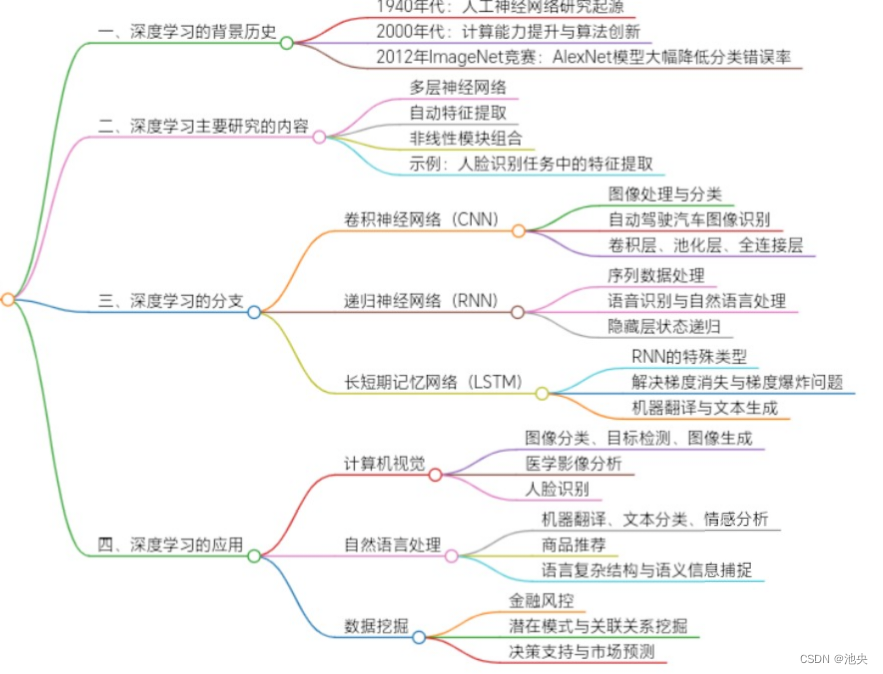

# 深度学习基础

> 深度学习是一种[人工智能](https://www.redhat.com/zh-cn/topics/ai)（AI）技术，用来训练计算机以模拟人脑的算法处理数据。

**主要内容**：感知机、激活函数、模型训练相关的（样本，特征，目标/损失函数）、深度学习实践、深度学习框架（pytorch）

## 背景介绍



深度学习的历史可以追溯到1940年代的人工神经网络研究。然而，直到2000年代，随着计算能力的提升和算法的创新，深度学习技术才开始取得重大突破。这一时期的标志性事件是Alex Krizhevsky在2012年度ImageNet竞赛中使用卷积神经网络（CNN）将分类错误率大幅降低，从而赢得了广泛关注。在ImageNet竞赛中，AlexNet模型通过深度卷积神经网络结构，成功地将分类错误率从之前的26%降低到15%，这一成果震撼了整个计算机视觉领域，也标志着深度学习技术的崛起。此后，深度学习技术迅速发展。

**深度学习是机器学习的一个子领域**

区别：

1. **方法和模型复杂度**：机器学习方法通常基于统计学和模式识别等原理，使用各种算法和模型来从数据中学习规律和模式。深度学习是机器学习的一个**子领域**，它专注于使用多层神经网络模型来学习更高级的抽象特征表示，可以处理更复杂的数据和任务。
2. **特征工程**：在传统机器学习中，通常需要手动进行特征工程，即**从原始数据中提取和选择合适的特征**。而在深度学习中，神经网络可以**自动从原始数据中学习特征表示**，减少了对手动特征工程的依赖。
3. **数据需求**：深度学习通常需要**大量的训练数据**来获得良好的性能，特别是在处理复杂任务时。机器学习方法相对而言**对数据量的要求较低**，但仍需要足够的数据进行模型训练。

联系：

1. **数据驱动**：机器学习和深度学习都是数据驱动的方法，它们通过从数据中学习模式和规律来进行预测、分类或其他任务。
2. **模型训练**：无论是机器学习还是深度学习，模型训练都是通过优化目标函数来调整模型参数，以最小化预测结果与真实标签之间的误差。这涉及到使用训练数据进行模型优化的过程。
3. **应用领域**：机器学习和深度学习都在各种领域得到广泛应用，如计算机视觉、自然语言处理、语音识别、推荐系统等。它们可以用于解决分类、回归、聚类、生成等各种机器学习任务。
4. **结合使用**：机器学习和深度学习并非相互排斥，而是可以结合使用。深度学习可以作为机器学习的一种工具或方法之一，用于处理特别复杂的任务，而机器学习方法可以用于处理数据较少或较简单的情况。

过程：


> 建议：用conda进行环境的管理，在第0节课已经进行了要求，如果未看可以下课看看下方的链接详细学习一下，但不影响本节课程的学习
>
> https://cloud.tencent.com/developer/article/1975317

## 感知机（Perceptron）

> **神经网络**和**支持向量机**的基础

感知机（perceptron）是二分类的线性分类模型，属于监督学习算法（不懂的可以[戳这里]([机器学习两种方法——监督学习和无监督学习（通俗理解）_机器学习的两种方式-CSDN博客](https://blog.csdn.net/zb1165048017/article/details/48579677?ops_request_misc=%7B%22request%5Fid%22%3A%225f09aadc41320adb22a7923acf9d9323%22%2C%22scm%22%3A%2220140713.130102334..%22%7D&request_id=5f09aadc41320adb22a7923acf9d9323&biz_id=0&utm_medium=distribute.pc_search_result.none-task-blog-2~all~top_positive~default-1-48579677-null-null.142^v102^pc_search_result_base5&utm_term=监督学习和非监督学习&spm=1018.2226.3001.4187))）。输入为实例的特征向量，输出为实例的类别（取+1和-1）。感知机旨在求出将输入空间中的实例划分为两类的分离超平面。为求得超平面，感知机导入了基于误分类的损失函数，利用梯度下降法对损失函数进行最优化求解。

  如果训练数据集是线性可分的，则感知机一定能求得分离超平面。如果是非线性可分的数据，则无法获得超平面。

​                                                                     线性可分


​																		线性不可分


感知机具有简单而易于实现的优点。感知机预测是用学习得到的感知机模型对新的实例进行预测的，因此属于判别模型。**感知机是神经网络和支持向量机的基础**。


## 激活函数

### 简介

[wiki-激活函数](https://zh.wikipedia.org/wiki/%E6%BF%80%E6%B4%BB%E5%87%BD%E6%95%B0)

在计算网络中， 一个节点的激活函数定义了该节点在给定的输入或输入的集合下的输出。标准的计算机芯片电路可以看作是根据输入得到开（1）或关（0）输出的数字电路激活函数。这与神经网络中的线性感知机的行为类似。然而，只有非线性激活函数才允许这种网络仅使用少量节点来计算非平凡问题。 在人工神经网络中，这个功能也被称为传递函数，旨在帮助网络学习数据中的复杂模式。


> 关于神经网络中为什么要引入激活函数，原因是如果没有激活函数，无论网络叠加了多少层，最终的模型也始终是线性的，无法应对非线性和非常复杂的模型的需求

### 常见的激活函数

#### sigmoid函数

函数表达式：


函数图像：


优点：1.Sigmoid函数的输出映射在(0,1)之间，单调连续，输出范围有限，优化稳定，可以用作输出层。

​			2.求导容易。

缺点：1.由于其软饱和性，容易产生梯度消失，导致训练出现问题。

​			2.其输出并不是以0为中心的。

#### Softmax函数

Softmax 是用于多类分类问题的激活函数，在多类分类问题中，超过两个类标签则需要类成员关系。对于长度为 K 的任意实向量Softmax 可以将其压缩为长度为 K，值在（0，1）范围内，并且向量中元素的总和为 1 的实向量。

函数表达式：


#### tanh函数

函数表达式：


图像：


优点：

- 输出范围是 $(-1, 1)$，因此可以对输入数据进行归一化，使得网络更容易收敛。
- 相较于 Sigmoid 函数，$\tanh$ 的值居中于 0，而不是偏向正值（如 Sigmoid 的范围是 $[0, 1]$）。这有助于在反向传播中减少梯度消失问题。

#### ReLU函数

函数表达式：


函数图像：


**优点**
计算简单：ReLU 函数只涉及取最大值的操作，因此计算非常高效。相比于 Sigmoid 和 Tanh 等激活函数，ReLU 的计算速度更快。
有效避免梯度消失问题：当输入为正数时，ReLU 的梯度为 1，能够有效地避免梯度消失问题。梯度消失通常出现在 Sigmoid 和 Tanh 等激活函数中，而 ReLU 的梯度在正区间始终为 1，保证了梯度的传播。
引入非线性：尽管 ReLU 在负区间输出为 0，但它仍然具有非线性特性，可以帮助神经网络学习复杂的非线性关系。
**缺点**
死神经元问题：当输入值为负时，ReLU 输出为 0，这意味着神经元不会对负输入做出反应。如果网络中有很多神经元输出为 0，这些神经元就成为了“死神经元”，无法再更新它们的权重，导致学习过程停滞。
不对称性：ReLU 函数的输出不对称，它只能对正输入做出响应，对于负输入输出为 0。虽然这能加速训练，但也限制了网络的表示能力。

#### ReLU变体

##### Leaky ReLU


其中$\alpha$是一个小的常数（如0.01）

Leaky ReLU：解决了死神经元的问题，输入为负数也能产生微小的的输出

其他变体：如PReLU，RReLU等等


参考：[10种常见的激活函数](https://mse.xauat.edu.cn/info/1037/1957.htm)

## 模型训练


### 1.**什么是模型的训练**

深度学习的训练过程是指通过大量的数据来调整神经网络的参数，以使其能够对输入数据进行准确的预测或分类

机器学习的几个重要概念和步骤:

（1）数据集准备：

- 通常使用[Pandas](https://so.csdn.net/so/search?q=Pandas&spm=1001.2101.3001.7020)、NumPy等库从CSV、Excel、数据库或直接从网络加载数据
- 数据预处理：使用正则表达式等工具进行文本清洗，jieba等库进行中文分词，并构建词汇表，将数据转换为适合输入模型的格式。

（2）权重和偏置项的初始化

正确的初始化方法可以显著提高训练的效率，并帮助避免由于不良初始化导致的训练失败。通常，He初始化和Xavier初始化是最受欢迎的选择

（3）预测输出

即前向传播，前向传播是指从输入数据开始，通过神经网络的各层逐层计算并传递数据，最终得到模型的输出结果。在前向传播过程中，输入数据通过每一层的权重和偏置进行线性变换，并经过激活函数进行非线性变换，然后输出到下一层，直到达到输出层。

（4）计算损失函数

深度学习中的损失函数（Loss Function）是一个衡量预测结果与真实结果之间差异的函数 ，也称为误差函数。它通过计算模型的预测值与真实值之间的不一致程度，来评估模型的性能。

（5）参数更新

在训练过程中，模型的目标是通过调整其参数来最小化损失函数的值，从而提高预测的准确性。

（6）迭代

不断重复前面的步骤（3）至（5），直到损失函数达到阈值提前结束循环或者达到设定的迭代次数

（7）预测和评估

常用的评估指标包括准确率、精确率、召回率和F1分数等。

### 2.**数据集**

深度学习的训练集的格式多种多样，通常以表格、数组或特定格式（例如 CSV 或 JSON）组织的数据集合，以便于检索和分析。

数据集相关的概念

- **训练集（Training Set）**

用于模型学习参数的数据集合，模型通过迭代拟合训练集数据，调整权重以最小化预测误差。

- **验证集（Validation Set）**

用于在训练过程中评估模型性能、调整超参数（如学习率、网络结构）的数据集合。不参与模型参数更新，帮助判断模型是否过拟合或欠拟合

- **测试集（Test Set）**

用于最终评估模型泛化能力的数据集合，模拟模型在真实场景中的表现。

- **标签（Label）**

关于样本结果的信息，用于监督学习中指导模型学习

- **批次大小（Batch Size）**

指模型每次参数更新时输入的样本数量。当 Batch Size=32，总样本数为1000 时，模型会从训练集中一次性抽取 32 个样本，计算这 32 个样本的平均损失后更新一次参数，最后一次则训练剩下的8个样本。

- **数据加载器（DataLoader）**、

深度学习框架（如 PyTorch、TensorFlow）中用于高效加载数据的工具。它能自动实现数据的分批（按 Batch Size 拆分）、打乱（Shuffle，避免模型学习数据顺序规律）、多进程并行加载（提升数据读取速度）等功能，同时支持对数据进行实时预处理，是连接数据集与模型训练流程的关键组件。

- **数据预处理（Data Preprocessing）**

对原始数据进行清洗、转换和标准化的过程，目的是使数据符合模型输入要求并提升模型性能。

- .......

在训练自己的大语言模型时，可以从以下几个途径找到合适的数据集：

**公开数据集**：有许多公开可用的数据集可供使用，涵盖了各种领域和任务。例如，Common Crawl、Wikipedia、OpenWebText、BookCorpus等都是常用的大规模文本数据集，可以用于语言模型的训练。
**开放数据平台**：许多组织和机构提供了开放的数据平台，可以获取各种类型的数据。例如，Kaggle、UCI Machine Learning Repository、Google Dataset Search等平台都提供了丰富的数据集资源。
**学术界研究**：许多学术研究项目会公开其使用的数据集，可以通过相关论文或项目页面找到这些数据集。例如，NLP领域的一些会议和竞赛（如ACL、EMNLP、CoNLL、GLUE等）提供了公开的数据集供研究使用。
**数据收集和爬取**：如果没有合适的公开数据集，您可以自己进行数据收集和爬取。这可以通过爬虫技术从互联网上收集相关的文本数据。需要注意的是，在进行数据收集和爬取时，需要遵守法律法规和网站的使用条款，并确保获得数据的合法使用权。
**数据增强**：如果您已经有了一些初始的数据集，但觉得数量不够，可以考虑使用数据增强技术来扩充数据。数据增强可以通过对原始数据进行一些变换、替换、合成等操作来生成新的样本。

### 3.**目标函数**

它的作用是量化模型预测结果与真实标签之间的差异。模型训练的本质就是寻找参数（权重和偏置项），使得这个目标函数的值达到最小。

| 名称     | 描述                                                         |
| -------- | ------------------------------------------------------------ |
| 损失函数 | 衡量**单个**样本的预测误差，也称代价函数                     |
| 目标函数 | 衡量**整个数据集**或**一个批次**上的预测误差的函数，通常是所有样本损失的平均值或总和。 |

**常见的损失函数**：

MSE（均方误差）：

```python
import tensorflow as tf
# 预测值
predictions = tf.constant([1.0, 2.0, 3.0])
# 真实值
labels = tf.constant([0.5, 2.5, 3.5])
# 计算均方误差
mse = tf.reduce_mean(tf.square(predictions - labels))
# 打印均方误差
print(mse.numpy())
```

Cross-Entropy Loss(交叉熵损失)：

```python
import torch
import torch.nn as nn
# 创建损失函数对象
loss_fn = nn.CrossEntropyLoss()
# 预测值（模型输出）
predictions = torch.tensor([[0.5, 0.2, 0.3], [0.1, 0.8, 0.1]])
# 真实标签
labels = torch.tensor([0, 2])
# 计算交叉熵损失
loss = loss_fn(predictions, labels)
# 打印交叉熵损失
print(loss.item())
```

Log Loss（对数似然损失）：

```python
import numpy as np
# 预测概率
probabilities = np.array([0.9, 0.2, 0.8])
# 真实标签（二分类问题中的0和1）
labels = np.array([1, 0, 1])
# 计算对数似然损失
log_loss = -np.mean(labels * np.log(probabilities) + (1 - labels) * np.log(1 - probabilities))
# 打印对数似然损失
print(log_loss)
```

### 4.**优化方法**

> 常见的优化方法（SGD，Adagrad，Adam，Momentum,  正则化，Dropout），其他的方法本节课程不做要求，仅做了解即可

| **优化方向**               | **方法名称**                      | **核心原理**                                                 | **适用场景**                                 | **优点**                                   | **缺点**                                       |
| -------------------------- | --------------------------------- | ------------------------------------------------------------ | -------------------------------------------- | ------------------------------------------ | ---------------------------------------------- |
| **优化器（参数更新）**     | 随机梯度下降（SGD）               | 每次用单个样本的梯度更新参数：*w*=*w*−*η*∇*L*                | 小规模数据集、简单模型                       | 内存占用低，实现简单                       | 梯度波动大，收敛慢，易陷入局部最优             |
|                            | 动量法（Momentum）                | 模拟物理动量，累积历史梯度：*v**t*=*γ**v**t*−1+*η*∇*L*，*w*=*w*−*v**t* | 缓解 SGD 震荡，加速收敛                      | 减少梯度震荡，加快收敛速度                 | 需调整动量参数*γ*（通常 0.9）                  |
|                            | 自适应梯度（Adagrad）             | 对不同参数用不同学习率：*w*=*w*−*G**t*+*ϵ**η*∇*L*（*G**t*为梯度平方累积） | 稀疏数据（如文本），参数更新频率差异大的场景 | 自动调整学习率，适合稀疏特征               | 学习率随迭代单调递减，可能过早停滞             |
|                            | 均方根传播（RMSprop）             | 指数衰减累积梯度平方：*E*[*g*2]*t*=0.9*E*[*g*2]*t*−1+0.1(∇*L*)2，动态调整学习率 | 解决 Adagrad 学习率衰减问题                  | 收敛稳定，适合非凸优化                     | 需手动设置衰减系数（通常 0.9）                 |
|                            | 自适应动量估计（Adam）            | 结合 Momentum 和 RMSprop：同时累积梯度一阶矩（动量）和二阶矩（自适应学习率） | 大多数场景（图像、文本、语音等），推荐首选   | 收敛快、稳定，对超参数敏感低               | 可能在某些任务中泛化能力略逊于 SGD + 动量      |
| **正则化（防过拟合）**     | L1 正则化                         | 损失函数加参数绝对值之和：*L**re**g*=*L*+*λ*∑∣*w*∣           | 特征选择（使部分参数为 0，简化模型）         | 产生稀疏权重，降低模型复杂度               | 导数不连续，优化难度略高                       |
|                            | L2 正则化（权重衰减）             | 损失函数加参数平方和：*L**re**g*=*L*+*λ*∑*w*2                | 大多数场景，通用防过拟合                     | 导数连续，优化稳定，抑制权重过大           | 不产生稀疏权重，可能保留冗余特征               |
|                            | Dropout                           | 训练时随机让部分神经元失活（概率*p*），测试时恢复            | 神经网络（如全连接、CNN）                    | 模拟集成学习，减少神经元共适应             | 需调整失活概率（通常 0.5），测试时需缩放输出   |
|                            | 早停（Early Stopping）            | 监控验证集损失，当损失不再下降时停止训练                     | 所有监督学习任务                             | 简单有效，避免过拟合到训练集               | 需合理设置 “耐心值”（容忍损失上升的轮次）      |
|                            | 数据增强（Data Augmentation）     | 对训练集随机变换（如旋转、裁剪、加噪），扩充数据多样性       | 图像、文本等数据有限的场景                   | 提升模型鲁棒性，无需修改模型结构           | 需设计与任务匹配的增强策略（如文本同义词替换） |
| **梯度处理（稳定训练）**   | 梯度裁剪（Gradient Clipping）     | 当梯度范数超过阈值时，缩放梯度至阈值内（如∇*L*′=min(threshold,∇*L*)） | RNN/LSTM（易梯度爆炸），深度网络             | 防止梯度爆炸，稳定训练                     | 需手动设置阈值，可能损失部分梯度信息           |
|                            | 批归一化（Batch Normalization）   | 对每批数据标准化（均值 0，方差 1），减少内部协变量偏移       | 深层网络（如 CNN、ResNet）                   | 加速收敛，允许更高学习率，降低对初始化敏感 | 增加计算量，小批量时效果下降                   |
|                            | 层归一化（Layer Normalization）   | 对单个样本的所有特征归一化，不依赖批次                       | RNN、Transformer 等序列模型                  | 不受批次依赖批次大小，适合动态序列长度     | 在 CNN 中效果通常不如批归一化                  |
| **学习率调度（优化收敛）** | 学习率衰减（Learning Rate Decay） | 随迭代逐步降低学习率（如阶梯衰减、指数衰减）                 | 大多数场景，防止后期训练震荡                 | 平衡前期快速收敛和后期精细调整             | 需手动设置衰减率和衰减周期                     |
|                            | 学习率预热（Warmup）              | 初始用小学习率逐步提升至目标值，再衰减                       | Transformer 等大模型，防止初期参数剧烈波动   | 稳定训练初期梯度，提升大模型收敛稳定性     | 增加超参数（预热步数、目标学习率）             |
|                            | 循环学习率（Cyclical LR）         | 学习率在区间内周期性波动（如锯齿形、三角形）                 | 难收敛的复杂任务，避免局部最优               | 可能跳出局部最优，找到更好参数             | 需精细调整区间范围和周期                       |


## 实践

见实践文件夹里的ipynb文件

## 深度学习框架

> 前文中尝试实践（手搓模型），是否感觉到想要设计一个哪怕结构简单的神经网络也很困难，哪怕是提前封装了一些激活函数，但是搭建整个神经网络的过程还是困难重重，所以有了深度学习框架，他将神经网络的底层逻辑（如参数初始化、前向计算、反向传播、梯度更新）进行了高度封装，把需要反复编写的冗余代码（如矩阵运算、优化器实现）转化为可直接调用的 API。开发者无需关注底层细节，只需通过简单的代码调用，就能像 “搭积木” 一样快速定义网络结构（如添加卷积层、全连接层）、配置训练流程（如设置优化器、损失函数），大幅降低了模型搭建的门槛，同时还能保证计算效率与稳定性，让精力更聚焦于模型设计、超参数调优和业务问题本身

#### 1.简介

近几年，随着深度学习的爆炸式发展，相关理论和基础架构得到了很大突破，它们奠定了深度学习繁荣发展的基础。这其中涌现了许多深度学习框架。这些框架各有所长，各具特色。常用的开源框架有TensorFlow、Keras、Caffe、PyTorch、Theano、CNTK、MXNet、PaddlePaddle、Deeplearning4j、ONNX等

#### 2.常见框架

- ## pytorch


PyTorch 是一个 Python 包，它提供了两个高级功能：

- 具有强大 GPU 加速的张量计算（如 numpy）。
- 基于带自动微分系统的深度神经网络 (DNN)。

重复使用您最喜欢的 Python 包，例如 numpy、scipy 和 Cython，以在需要时扩展 PyTorch。

- ## TensorFlow


- TensorFlow 是一个使用数据流图进行数值计算的开源软件库。图中的节点表示数学运算，而图的边表示在节点之间流动的多维数据数组（张量）。这种灵活的架构允许您将计算部署到桌面、服务器或移动设备上的一个或多个 CPU 或 GPU，而无需重写代码。为了可视化 TensorFlow 结果，TensorFlow 提供了一套可视化工具 TensorBoard。

- ## PaddlePaddle

  

  PaddlePaddle 提供了直观灵活的数据加载和模型结构指定接口，支持 CNN、RNN 及多种变体，轻松配置复杂的深度模型。

  PaddlePaddle还提供了极其优化的操作、内存回收和网络通信，并可以轻松扩展异构计算资源和存储，以加速训练过程。

- **Keras**


Keras 提供了丰富的预定义层（如全连接层、卷积层、循环层）、激活函数、优化器和损失函数，支持 Sequential（序贯）和 Functional API（函数式）两种模型构建方式：

- Sequential 适合搭建简单的线性堆叠网络；
- Functional API 则支持构建多输入、多输出、带有分支或残差连接的复杂网络结构。

此外，Keras 还内置了多种预训练模型（如 VGG、ResNet、Inception），可直接用于迁移学习，极大降低了深度学习的入门门槛，尤其适合快速原型开发、教学演示和中小型项目实现。

#### 3.pytorch

> PyTorch是由Meta AI(Facebook)人工智能研究小组开发的一种基于Lua编写的Torch库的Python实现的深度学习库，目前被广泛应用于学术界和工业界，相较于Tensorflow2.x，PyTorch在API的设计上更加简洁、优雅和易懂。

安装：

```bash
pip install torch
```

```bash
conda install torch
```

##### （1）张量（Tensor）

几何代数中定义的张量是基于向量和矩阵的推广，比如我们可以将标量视为零阶张量，矢量可以视为一阶张量，矩阵就是二阶张量。张量是现代机器学习的基础。它的核心是一个数据容器，多数情况下，它包含数字，有时候它也包含字符串，但这种情况比较少。

在PyTorch中， `torch.Tensor` 是存储和变换数据的主要工具。如果你之前用过`NumPy`，你会发现 `Tensor` 和NumPy的多维数组非常类似。然而，`Tensor` 提供GPU计算和自动求梯度等更多功能，这些使 `Tensor` 这一数据类型更加适合深度学习。

1.**随机初始化矩阵** 我们可以通过`torch.rand()`的方法，构造一个随机初始化的矩阵：

```python
import torch
x = torch.rand(4, 3) 
print(x)
```

2.**全0矩阵的构建** 我们可以通过`torch.zeros()`构造一个矩阵全为 0，并且通过`dtype`设置数据类型为 long。除此以外，我们还可以通过torch.zero_()和torch.zeros_like()将现有矩阵转换为全0矩阵.

```python
import torch
x = torch.zeros(4, 3, dtype=torch.long)
print(x)
```

3.**张量的构建** 我们可以通过`torch.tensor()`直接使用数据，构造一个张量：

```python
import torch
x = torch.tensor([5.5, 3]) 
print(x)
```

4.基于已经存在的tensor创建一个tensor：

```python
x = x.new_ones(4, 3, dtype=torch.double) 
# 创建一个新的全1矩阵tensor，返回的tensor默认具有相同的torch.dtype和torch.device
# 也可以像之前的写法 x = torch.ones(4, 3, dtype=torch.double)
print(x)
x = torch.randn_like(x, dtype=torch.float)
# 重置数据类型
print(x)
# 结果会有一样的size
# 获取它的维度信息
print(x.size())
print(x.shape)
```

常见构造tensor的方法：

|                函数 | 功能                                              |
| ------------------: | ------------------------------------------------- |
|       Tensor(sizes) | 基础构造函数                                      |
|        tensor(data) | 类似于np.array                                    |
|         ones(sizes) | 全1                                               |
|        zeros(sizes) | 全0                                               |
|          eye(sizes) | 对角为1，其余为0                                  |
|    arange(s,e,step) | 从s到e，步长为step                                |
| linspace(s,e,steps) | 从s到e，均匀分成step份                            |
|   rand/randn(sizes) | rand是[0,1)均匀分布；randn是服从N(0，1)的正态分布 |
|    normal(mean,std) | 正态分布(均值为mean，标准差是std)                 |
|         randperm(m) | 随机排列                                          |

**张量的操作：**

```python
'''加法操作'''
import torch
# 方式1
x = torch.rand(4, 3)
y = torch.rand(4, 3) 
print(x + y)

# 方式2
print(torch.add(x, y))

# 方式3 in-place，原值修改
y.add_(x) 
print(y)

'''索引'''
x = torch.rand(4,3)
# 取第二列
print(x[:, 1]) 

y = x[0,:]
y += 1
print(y)
print(x[0, :]) # 源tensor也被改了了

'''维度变换'''
x = torch.randn(4, 4)
y = x.view(16)
z = x.view(-1, 8) # -1是指这一维的维数由其他维度决定
print(x.size(), y.size(), z.size())

###为了使创建的张量和原始张量不共享内存，可以使用第二种方法torch.reshape()


'''广播机制'''
x = torch.arange(1, 3).view(1, 2)
print(x)
y = torch.arange(1, 4).view(3, 1)
print(y)
print(x + y)
```

##### （2）自动求导

代码实例：线性回归的自动求导

```python
import torch
import numpy as np

# 准备数据
np.random.seed(0)
X = np.random.rand(100, 1)
Y = 2 + 3 * X + 0.1 * np.random.randn(100, 1)

X = torch.from_numpy(X).float()
Y = torch.from_numpy(Y).float()

# 初始化权重和偏置
w = torch.tensor([1.], requires_grad=True)#参数设为True，追踪该张量参与的所有运算
b = torch.tensor([1.], requires_grad=True)

# 定义模型和损失函数
def forward(x):
    return w * x + b

loss_fn = torch.nn.MSELoss()

# 训练循环
learning_rate = 0.01
for epoch in range(1000):
    # 前向传播
    y_pred = forward(X)
    
    # 计算损失
    loss = loss_fn(y_pred, Y)
    
    # 反向传播
    loss.backward()
    
    # 更新权重
    with torch.no_grad():
        w -= learning_rate * w.grad
        b -= learning_rate * b.grad
        
        # 清零梯度
        w.grad.zero_()
        b.grad.zero_()
    
    if (epoch+1) % 100 == 0:
        print(f'Epoch [{epoch+1}/1000], Loss: {loss.item():.4f}')

print('Final weights:', w.item(), 'bias:', b.item())
```

## 作业

0.跟着敲一遍课件（README）上所有代码，掌握基础操作

1.跑通实践文件夹的代码，并尝试修改激活函数，模型架构，优化器，超参数等等，并对比效果

2.尝试训练一个 $z_3 = x_1+ x_2^2+x_3^3$的函数（要求：使用一种深度学习框架，尝试使用不同的激活函数、损失函数、优化方法等）

附：可以自己找一些DL项目尝试跑一跑，但不属于本次课要求范围，不做要求

## 提交

**邮箱**:pinesong721@gmail.com,**附上名字+学号**

**截至时间**:下次上课之前

## 课后链接：

> 有兴趣可以自己探索一下

- [动手学深度学习](https://zh.d2l.ai/index.html)
- [DeepLearning Tutorial](https://github.com/Mikoto10032/DeepLearning)
- [PyTorch Tutorial](https://docs.pytorch.org/tutorials/)
- [PyTorch-runoob](https://www.runoob.com/pytorch/pytorch-tutorial.html)
