🌟神经网络与多层感知机
===========

本次课将会先介绍机器学习中最重要的内容之一——神经网络（neural network，NN），它是深度学习的基础。神经网络的名称来源于生物中的神经元。自有计算机以来，人们就希望能让计算机具有和人类一样的智能，因此，许多研究者将目光放到了人类的大脑结构上。作为生物神经系统的基本单元，神经元在形成智能的过程中起到了关键作用。神经元的结构并不复杂，简单来说，神经元由树突、轴突和细胞体构成。由其他神经元传来的神经脉冲在细胞间通过神经递质传输。神经递质被树突接收后，相应的神经信号传给细胞体，由细胞体进行处理并积累。当积累神经递质的兴奋性超过了某个阈值，就会触发一个动作电位，将新的信号传至轴突末梢的突触，释放神经递质给下一个神经元。生物的智能、运动等几乎所有生命活动的控制信号都由这些看似简单的神经元进行传输。

-------------------------------------------------------------------------------------------------------------

既然动物能够通过神经元建立智能，我们自然会想，能不能通过模拟神经元的结构和行为方式，建立起人工智能呢？于是，从 1943 年的沃伦·麦卡洛克（Warren McCulloch）和沃尔特·皮茨（Walter Pitts）开始，研究者们设计了人工神经网络（artificial neural network，ANN），现在通常简称为神经网络（NN）。在 NN 中，最基本的单位也是神经元。在最开始的设计中，人工神经元完全仿照生物神经元的结构和行为方式，而大量的神经元互相连接，构成一张有向图。每个神经元是一个节点，神经元之间的连接就作为有向边。在神经元中，这些神经元发送的信号通过连接权重加权求和，得到内部信号总和，即

                                                                                                         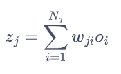
此外，每个神经元还有提前设置好的阈值，当处理结果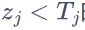时，神经元的输出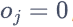，反之输出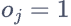。这一设计是为了模拟生物神经元的激励与抑制信号。这样，当某个神经元收到外部输入时，就会对输入进行处理，再按上面的计算方式给其指向的其他神经元输出新的信号。这样的行为方式与生物神经元非常相似，然而，其表达能力十分有限，能解决的问题也很少。此外，每个神经元上的参数还需要人为指定。因此，这时的神经网络还只是具有雏形。

-------------------------------------------------------------------------------

上文提到的神经网络的最大问题在于，每条边上的权重都需要人为指定。当神经网络的规模较大、结构较为复杂时，我们很难先验地通过数学方法计算出合适的权重，从而这样的网络也很难用来解决实际问题。为了简化复杂的神经网络，1958 年，弗兰克·罗森布拉特（Frank Rosenblatt）提出了感知机（perceptron）的概念。他从生物接受刺激、产生感知的过程出发，用神经网络抽象出了这一模型，如图 8-2 所示。与原始的神经网络类似，输入经过神经元后被乘上权重并求和。但是，感知机还额外引入了偏置（bias）项，把它一起加到求和的结果上。最后，该结果再通过模型的激活函数（activation function），得到最终的输出。


                                                                                                        图2 感知机的结构


感知机中有两个新引入的结构。第一是偏置，它相当于给线性变换加入了常数项。我们知道，对于一维的线性函数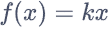来说，无论我们如何调整参数，它都一定经过原点。而加入常数项变为后，它就可以表示平面上的任意一条直线，模型的表达能力大大提高了。第二是激活函数，它可以模拟神经元的兴奋和抑制状态。在感知机中，激活函数通常是示性函数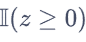。当输入非负时，函数输出 1，对应兴奋状态；输入为负数时，函数输出 0，对应抑制状态。整个感知机模拟了一组神经元受到输入刺激后给出反应的过程，可以用来解决二分类问题。

感知机最重要的进步在于，它的参数可以自动调整，无须再由人工繁琐地一个一个调试。假设二分类问题中，样本的特征为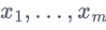，标签。那么感知机对该样本的预测输出为：

                                                                                        

罗森布拉特利用生物中的负反馈调节机制来调整感知机的参数。其参数根据反馈进行更新：

                                                                                         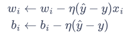

如果感知机的预测正确，其收到的反馈为 0，参数不更新。如果感知机预测为 0，但样本的真实标签为 1，感知机收到的反馈为-1，说明其预测结果整体偏大，需要将权重和偏置下调；如果感知机预测为 1，真实标签为 0，则需要将权重和偏置上调。可以看出，这一思想已经具有了梯度下降法的影子。凭借着参数自动训练的优点，感知机成为了第一个可以解决简单实际问题的神经网络。罗森布拉特曾在电脑中构建出感知机模型，并用打孔卡片进行训练，卡片上的孔位于左侧或右侧。在 50 次试验后，模型学会了判断卡片上的孔位于哪一边。

然而，感知机模型存在致命的缺陷，那就是它只能处理线性问题。1969 年，马文·明斯基（Marvin Minsky）提出了异或问题。对输入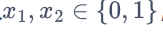，当其相同时输出 0，不同时输出 1。作为一个简单的逻辑运算，异或的真值表如表1 所示。

                表 1 异或运算的真值表

| x1  | x2  | x1  xor  x2 |
| --- | --- | ----------- |
| 0   | 0   | 0           |
| 0   | 1   | 1           |
| 1   | 0   | 1           |
| 1   | 1   | 0           |

异或问题的输入只有 4 种可能，如果把所有输入和其输出在平面直角坐标系中画出来，无非是 4 个点而已，如图 3 所示。其中，左下和右上的点是红色，左上和右下的点是蓝色。要解决异或问题，模型只需要将红色和蓝色的点区分开。然而，读者可以自行验证，红点和蓝点无法只通过一条直线分隔开，从而感知机无法解决异或问题。这一事实被提出后，感知机的表达能力和应用场景遭到广泛质疑，神经网络的研究也陷入了寒冬。

![xor](data:image/png;base64,iVBORw0KGgoAAAANSUhEUgAAAoAAAAHgCAYAAAA10dzkAAAAOXRFWHRTb2Z0d2FyZQBNYXRwbG90bGliIHZlcnNpb24zLjcuMSwgaHR0cHM6Ly9tYXRwbG90bGliLm9yZy/bCgiHAAAACXBIWXMAAA9hAAAPYQGoP6dpAAAlRElEQVR4nO3dT2ic95348Y8sKaq9iTNWQnGXOGzGsPSSiyyd3IYsGbWll+BEimGhsCy1VNpTDaup99Dd9OKVWJpbWim5FRZsade/UiisZ7oN2+TkeCjkUkI03UXbXRZseawuceWRNb/DVBPrn21ZGs1ovq8XGHueeeR+9PSJ9PbzT121Wq0WAAAk41CrBwAAYH8JQACAxAhAAIDECEAAgMQIQACAxAhAAIDECEAAgMQIQACAxAhAAIDECEAAgMQIQACAxAhAAIDECEAAgMQIQACAxPS0eoAUlUqlKBaLERFx7dq1eOeddyKTyWy5brlcjrm5uchms1Eul2NsbGzbdQEAHoUAbIFisRgTExMRETE1NRWvvPJKXL9+fct1R0dHG++Vy+U4d+5czM7O7tusAEDncQp4n5VKpbh48WLj9cjISJRKpSiXy5vW3bgsm802jhwCADwuAbjPBgYG4p133mm8rlQqERHR39+/ad1isbhpeX9/f5RKpabOCAB0NqeAW2BkZKTx50uXLkUul9vyur61ONxocXFxy+XLy8uxvLzceL26uhqLi4vxzDPPRFdX165mBiAdtVotfv/738ef/umfxqFDjhV1IgHYQpVKJebm5ra9/u9BH7eVixcvxptvvrkHkwFAxMLCQjz33HOtHoMmEIAtlM/no1AobHtXbyaT2XS0b3Fxcdv1L1y4EOfPn2+8vn37djz//PPx29/+Np566qm9GrtlqtVq/PKXv4y/+Iu/iN7e3laP01Fs2+axbZvHtm2excXF+PM///OO+N7B1gRgi0xNTUU+n49sNts4orcx7HK5XExPT2/62MHBwS3/zr6+vujr69u0vL+/P44ePbrrmVutWq3GkSNH4plnnvHFfo/Zts1j2zaPbdt8Lh/qXE7st8Dc3FwMDAw04u/y5cuN+Lv/juBsNrvu48rlcgwODnoOIACwK44A7rNyuRyjo6PrlmUymRgbG4uI+nV8Q0NDjecEzs7ORj6fj6Ghobh27ZpnAAIAuyYA91k2m41arbbt+xsDL5vNxuTkZESsv3sYAOBxOQUMAJAYAQgAkBgBCACQGAEIAJAYN4EAJKRarca9e/daPcaeqFar0dPTE3/4wx865nNqhu7ubs9JZBMBCJCApaWluHHjxrqfF37Q1Wq1OH78eCwsLHhg8UP09fXFs88+2xE/FIC9IQABOtzS0lL87ne/iyeffDKeffbZ6O3t7YhgWl1djf/7v/+LJ598Mg4dckXTVmq1WlSr1bh9+3b87ne/i4gQgUSEAAToeDdu3Ignn3wynnvuuY4IvzWrq6tx9+7d+NznPicAH+Dw4cPx1FNPxX/913/FjRs3BCAR4SYQgI5WrVZjeXk5nn766Y6KP3amq6srnn766VheXo5qtdrqcWgDAhCgg63dHOEmANb2ATfMECEAAZLg6B/2Ae4nAAEAEiMAAQASIwABABLjMTAAcABMTU3FzZs345lnnon5+fkYHh6OkZGRVo/FASUAAaDNjY+Px8mTJ2NycrKxbHh4OBYXF2NsbKyFk3FQCUAAaGOlUilmZmaiVqutWz45ORmnTp0SgDwW1wACQBubnp6OgYGBTcvXls3Nze33SHQAAQhAc9y5E/G//1v/ncdWLBYjm81u+V4mk4lCobDPE9EJBCAAe+v99yNeey3iyScjjh+v//7aaxEffNDqybaVz+cbvzYaHR2NmZmZFkxVVy6Xo7+/f8v3+vv748MPP9zniegEAhCAvfOjH0W89FLEz34WsbpaX7a6Wn/95S9H/PjHrZ1vC1NTUzE5ORnj4+MxNTUVlUql8V6lUom5ubltA6zZ7p9lK5lM5qHrwFbcBALA3nj//YjvfCeiVotYWVn/3trrb3874sUXI06f3v/5tlAulyOTyURE/WaLiGi8jojG0bVcLvfAvyefzz/WtXiTk5Me5UJLCEAA9sYPfxjR3b05/u7X3R3x1lttE4CVSqVxF+309PSm0CsUCpHNZtdF4VYmJyfXPaJlrzzsf9fRPx6XU8AA7N6dOxE//emD4y+i/v6VK21zY8janbSVSiWKxWKMj4+ve79YLD706F8rLS4uPjQSYSsCEIDdW1r67Jq/h1ldra/fRi5fvhwRsel0bKlUiuHh4VaM1JDJZGJxcXHL9yqVSgwODu7zRHQCp4AB2L2jRyMOHXq0CDx0qL5+G1k71Xu/YrEYEQ+//i+ifg3g2vo7ceHChYdeA/jGG2888E7fVgcqB5MABGD3Dh+OePXV+t2+DzoN3NNTX+/w4f2b7RFtfNhyoVCITCbzSKdYm3H935q1x9BUKpV1s+wkUGEjp4AB2Bvnz0fcu/fgde7di/jud/dnnh0YGhqKcrnceF0qlWJqaqot4iqXy8XIyEhcvHhx3fLJycmYnZ11DSCPxRFAAPbGl74U8fbb9Ue9bLwbuKenHn9vv902dwDfb2JiIq5du9Z4EPTJkycjon1Or87OzsbU1FTk8/l45plnYn5+PsbHxz1ChscmAAHYO9/6Vv05f2+9Vb/bd3W1fs3fq6/Wj/y1YfytmZ2dbfx57fTqG2+80apxNpmYmGj1CHQQAQjA3jp9uv7rzp363b5Hj7blNX9rZmZmYn5+ft11fGsPaHZ6lU4lAAFojsOH2zr81uTz+XVH+orFYnz44Yfx29/+toVTQXO5CQSApL3xxhsxPT0dEfXn6o2Pj7u5go7nCCAAScvn85HP5+PkyZMxPz+/5TMBodMIQACSls1mm/ocP2hHTgEDACRGAAIAJEYAAgAkRgACACRGAAIAJEYAAgAkRgACACRGAAIAJEYAAgAkRgACACRGAALAAVGpVGJ0dDTm5uZaPQoHnJ8FDABtbnR0NPr7+yMiYm5uLs6ePdviiTjoBCAAtLnZ2dmIiCiXyzEzM9PiaegETgEDsGfu3t3d+8D+EIAA7IlLlyJefDFiYWHr9xcW6u9furS/cwGbCUAAdu3u3Yjvfz/i448jXn55cwQuLNSXf/xxfb12OxKYz+cbvzYaHR112pWOIwAB2LUnnogoFiOy2YhyeX0ErsVfuVx/v1isr98upqamYnJyMsbHx2NqaioqlUrjvUqlEnNzc40bMKBTuAkEgD1x4kTEe+99Fnsvvxzxk59EfOMbn8Xfe+/V12sX5XI5MplMRESUSqWIiMbriIgPP/wwIiJyudwD/558Pv9Yj2aZnJyMkZGRHX8c7JYABGDPbIzA06fry9sx/iLqR/jGxsYiImJ6enpT6BUKhchms+uicCuTk5MxOTnZrDFhzzkFDMCeOnGifuTvfj/5SfvFX0TEwMBARNRDsFgsxvj4+Lr3i8XiQ4/+wUEkAAHYUwsL9dO+9/vGN7a/O7gdXL58OSJi0+nYUqkUw8PDrRgJmsopYAD2zMYbPu6/BvDll9vzNHDEZ6d671csFiPi4df/RdSvAVxbfycuXLjgGkBaQgACsCc2xt9a7G28MaRdI3DtdPCaQqEQmUzmodf/RYTr/zhwnAIGYNfu3o3I5ba+23ctAtceEZPLtd9zAIeGhqJcLjdel0qlmJqaarvr/9YeUbO4uNjaQTjwHAEEYNeeeCLiBz+oP+S5WNx8hG8tAnO5+nrt9BzAiIiJiYm4du1a40HQJ0+ejIhom+v/8vl8lMvlxqNq8vl8FAqF6O/vj+np6RZPx0EkAAHYE2fPRpw5s33cnTgR8dFH7Rd/a2ZnZxt/Xrue74033mjVOOs4xcxecwoYgD3zsLhrx/ibmZnZ9CPg1h7Q/CjX/8FBJAABSFo+n1/349+KxWJ8+OGH8c4777RuKGgyAQhA0t54443GdXSVSiXGx8djdnbW0T86mmsAAUhaPp+PfD4fJ0+ejPn5+S2fCQidRgACkLRsNusmC5LjFDAAQGIEIABAYgQgAEBiBCBAAmq1WqtHoMXsA9xPAAJ0sEOH6l/m79271+JJaLW1fWBtnyBt9gKADtbb2xvd3d1x586dVo9Ci925cye6u7ujt7e31aPQBgQgQAfr6uqKI0eOxO3btx0FTNi9e/fi9u3bceTIkejq6mr1OLQBzwEE6HCf//zn4z/+4z/iP//zP6O/vz/6+vo6IgJWV1fj7t278Yc//MFpzW3UarVYXl6OxcXFWF1djc9//vOtHok2IQABOtwTTzwRzz33XNy4cSP+53/+p9Xj7JlarRZ37tyJw4cPd0TQNtOf/MmfxPHjx+OJJ55o9Si0CQEIkIAjR47E888/HysrK7GystLqcfZEtVqNf//3f4+XXnrJdW0P0NPTEz09vt2znj2iBUqlUpw7dy6uX7/+0PUiIgYGBqJcLkelUomBgYH9GBHoUJ0UA93d3bGyshKf+9znBCDskIsm9tnc3FxEfBZ3DzI9PR2nTp2Krq6uGB8f98PJAYA90Rn/DDxARkZGHnndU6dOxa1btyIiIpPJNGkiACA1ArDNCT8AYK8JwDZWqVQap4yvXbv20NPAy8vLsby83Hi9tLQUEfULpavVanOH3Qdrn0MnfC7txrZtHtu2eWzb5rFNO19XzQ8HbImurq6H/lzGSqXSOAJYKpVidHQ05ufnt13/7//+7+PNN9/ctPyf/umf4siRI7uaF4B0fPrpp/GXf/mXcfv27Th69Girx6EJBGCLPEoAlkqlxl2/lUoljh07FvPz89seBdzqCOCJEyfixo0bHfEfcLVajUKhEMPDw+7422O2bfPYts1j2zbPzZs34wtf+IIA7GBOAbepUqkUr7zySuMmkDX9/f3bfkxfX1/09fVtWt7b29tRXxw77fNpJ7Zt89i2zWPb7j3bs/N5DEwLVSqVda9LpVKUy+WIiMhmszE5Odl4r1gsxsjIiJtCAIBdcwRwnxWLxSgUChERcfHixRgaGmo8Gmbt9cTERGQymRgcHIypqanIZDIxPz8fs7OzrRwdAOgQAnCf5XK5yOVy647urdkYeAMDA37yBwCw55wCBgBIjAAEAEiMAAQASIwABABIjAAEAEiMAAQASIwABABIjAAEAEiMAAQASIwABABIjAAEAEiMAAQASIwABABIjAAEAEiMAAQASIwABABIjAAEAEiMAAQASIwABABIjAAEAEiMAAQASIwABABIjAAEAEiMAAQASIwABABIjAAEAEiMAAQASIwABABIjAAEAEiMAAQASIwABABIjAAEAEiMAAQASIwABABIjAAEAEiMAAQASIwABABIjAAEAEiMAAQASIwABABIjAAEAEiMAAQASIwABABIjAAEAEiMAAQASIwABABIjAAEAEiMAAQASIwABABIjAAEAEiMAAQASIwABABIjAAEAEiMAAQASIwABABIjAAEAEiMAAQASIwABABIjAAEAEiMAAQASIwABABIjAAEAEiMAAQASIwABABIjAAEAEiMAAQASIwABABIjAAEAEiMAAQASIwABABIjAAEAEiMAAQASIwABABIjAAEAEiMAAQASIwApK3dvbu796Hl7tyJvkol4s6dVk8C0CAAW6BUKsWpU6ceul65XI6pqamYm5uLqampqFQqzR+ujVy6FPHiixELC1u/v7BQf//Spf2dCx7J++9HvPZa9Bw7Fl/7q7+KnmPHIl57LeKDD1o9GYAA3G9zc3MRUY/AhxkdHY2JiYkYGRmJkZGROHfuXLPHaxt370Z8//sRH38c8fLLmyNwYaG+/OOP6+s5Ekhb+dGPIl56KeJnP4uu1dWIiPrvP/tZxJe/HPHjH7d4QCB1AnCfjYyMxMDAwEPXK5fL615ns9koFovNGqvtPPFERLEYkc1GlMvrI3At/srl+vvFYn19aAvvvx/xne9E1GoRKyvr31tZqS//9rcdCQRaSgC2qWKxGP39/euW9ff3P9KRw05x4kTEe+99FoHDwz3xm98ci+Hhnkb8vfdefT1oGz/8YUR394PX6e6OeOut/ZkHYAs9rR6ArW13vd/i4uK2H7O8vBzLy8uN10tLSxERUa1Wo1qt7ul8++X48YhCIf4YfV3xve+9FBER2WwtCoWVOH484oB+am1lbf84qPtJ27hzJ3p++tPGad9traxE7cqVWFlaijh8eH9m60D22+axTTufADxgHnQjyMWLF+PNN9/ctPzq1atx5MiRJk7VfGNjxxrxV3/9q/joo1vx0UctHKoDFQqFVo9woPVVKvG1h8XfH3WtrsYvrlyJ5UymuUMlwH679z799NNWj0CTddVqtVqrh0hRV1dXPGjTz8zMxPT0dFy/fr2x7NixYzE7Oxu5XG7Lj9nqCOCJEyfixo0bcfTo0b0bfp8tLHx2BHDN2hFAp3/3RrVajUKhEMPDw9Hb29vqcQ6uO3ei59ixhx8BjIjaoUOxcuuWI4C7YL9tnps3b8YXvvCFuH379oH+/sH2HAFsU7lcLqanpzctHxwc3PZj+vr6oq+vb9Py3t7eA/vFsR5/azd81GJs7FcxM/PlKJe7Yni41zWAe+wg7yttobc34tVX63f7brwB5H49PdH16qvR6xvrnrDf7j3bs/O5CaSFNp7OLZVKjbt/s9nsuvfK5XIMDg5GJqHTRRvv9i0UVuKLX7wVhcLKlncHQ1s4fz7i3r0Hr3PvXsR3v7s/8wBsQQDus2KxGPl8PiLq1+ytPRdwq9ezs7ORz+djbm4upqenY3Z2dt/nbZW7dyNyudjybt+Ndwfncp4DSBv50pci3n47oqsromfDSZaenvryt9+OOH26NfMBhGsAO9rS0lI8/fTTB/YajkuX6g95Lhbr0VetVuPnP/95fP3rX4/e3t5YWKjH3w9+EHH2bKunPdg2blv2wAcfRLz1VtSuXImu1dWoHToUXWfO1I/8ib89Yb9tnps3b8azzz57YL9/8HCuAaRtnT0bcebM9g95PnEi4qOPPASaNnX6dMTp07GytBS/uHIlXjlzxjV/QNtwCpi29rC4E3+0vcOH6496cbcv0EYEIABAYgQgAEBiBCAAQGIEIABAYgQgAEBiBCAAQGIEIABAYgQgAEBiBCAAQGIEIABAYgQgAEBiBCAAQGIEIABAYgTgI1paWmr1CAAAe0IAPqKBgYHo7u6Or371q3HhwoX45S9/2eqRAAAeiwB8RJ988klcu3YtcrlcXL9+PV5//fXo7u6OoaGhuHDhQvzLv/xLq0cEAHgkAnAHBgYG4m/+5m/i6tWrsbi4GJ988kmcO3cuZmdn45vf/GZ0d3fH3/7t37Z6TACABxKAu/DCCy/E2NhYfPLJJzE5ORmffPJJfPLJJ/HVr3611aMBAGxLAD6ipaWlePfdd+Pf/u3ftny/q6srXnjhhbh8+XKMjY3FP/7jP+7zhAAAj0YAPqKJiYm4evVqjIyMRHd3d5w9ezbefffd+PWvfx2//vWvo1AoNNZ9/fXXo1artXBaAIDtCcBHNDw8HJcvX47FxcX413/91zh27Fj8wz/8QwwMDMTo6GiMj49HRMS7774bS0tLkc1mWzwxAMDWelo9wEExMDAQ7777buRyucavrVy+fDlmZ2cbQQgA0G4E4CN64YUX4pvf/Gb88z//c/zZn/3ZtutdvXp1/4YCAHgMTgHv0Ouvv97qEQAAdkUAAgAkRgACACRGAAIAJEYAAgAkRgACACRGAAIAJEYAAgAkRgACACRGAAIAJEYAAgAkRgACACRGAAIAJEYAAgAkRgACACRGAAIAJEYAAgAkRgACACRGAAIAJEYAAgAkRgACACRGAAIAJEYAAgAkRgACACRGAAIAJEYAAgAkRgACACRGAAIAJEYAAgAkRgACACRGAAIAJEYAAgAkRgACACRGAAIAJEYAAgAkRgACACRGAAIAJEYAAgAkRgACACRGAAIAJEYAAgAkRgACACRGAAIAJEYAAgAkRgACACRGAAIAJEYAAgAkRgACACRGAAIAJEYAAgAkRgACACSmp9UDpKhcLsfc3Fxks9kol8sxNjYWmUxmy3VLpVJERAwMDES5XI5KpRIDAwP7OC0A0GkEYAuMjo7G9evXI6Ieg+fOnYvZ2dkt152eno6ZmZmIiMjlctuuBwDwqATgPiuXy+teZ7PZKBaL265/6tSpuHXrVkTEtkcJAQB2wjWA+6xYLEZ/f/+6Zf39/Y1TvVvJZDLiDwDYM44A7rNKpbLl8sXFxW3Xn5ubi4iIa9euxfj4eGSz2S3XXV5ejuXl5cbrpaWliIioVqtRrVZ3MXV7WPscOuFzaTe2bfPYts1j2zaPbdr5BGCb2C4M779BJJvNxvDwcMzPz2+57sWLF+PNN9/ctPzq1atx5MiRvRq15QqFQqtH6Fi2bfPYts1j2+69Tz/9tNUj0GQCcJ9lMplNR/sWFxe3PcVbLpcbd/2u3TVcLpe3PAp44cKFOH/+fOP10tJSnDhxIr7yla/E0aNH9+6TaJFqtRqFQiGGh4ejt7e31eN0FNu2eWzb5rFtm+fmzZutHoEmE4D7LJfLxfT09Kblg4ODm5aVSqV45ZVXGjeBrNl4DeGavr6+6Ovr27S8t7e3o744dtrn005s2+axbZvHtt17tmfncxPIPtt45K5cLsfg4GDjCGCpVGrcKZzNZmNycrKxbrFYjJGRETeEAAC74ghgC8zOzkY+n4+hoaG4du3aumf7Xbx4MYaGhmJiYiIymUwMDg7G1NRUZDKZmJ+f9xxAAGDXBGAL3H9kb2RkZN17GwNvYGDAT/4AAPaUU8AAAIkRgAAAiRGAAACJEYAAAIkRgAAAiRGAAACJEYAAAIkRgAAAiRGAAACJEYAAAIkRgAAAiRGAAACJEYAAAIkRgAAAiRGAAACJEYAAAIkRgAAAiRGAAACJEYAAAIkRgAAAiRGAAACJEYAAAIkRgAAAiRGAAACJEYAAAIkRgAAAiRGAAACJEYAAAIkRgAAAiRGAAACJEYAAAIkRgAAAiRGAAACJEYAAAIkRgAAAiRGAAACJEYAAAIkRgAAAiRGAAACJEYAAAIkRgAAAiRGAAACJEYAAAIkRgAAAiRGAAACJEYAAAIkRgAAAiRGAAACJEYAAAIkRgAAAiRGAAACJEYAAAIkRgAAAiRGAAACJEYAAAIkRgAAAiRGAAACJEYAAAIkRgAAAiRGAAACJEYAAAIkRgAAAiRGAAACJEYAAAIkRgAAAiRGAAACJEYAAAIkRgAAAiRGAAACJEYAAAIkRgAAAiRGAAACJEYAAAIkRgAAAiRGAAACJEYAcHHfuRF+lEnHnTqsngQe6e3d37wM0mwBsgXK5HFNTUzE3NxdTU1NRqVT2ZN2O9f77Ea+9Fj3HjsXX/uqvoufYsYjXXov44INWTwabXLoU8eKLEQsLW7+/sFB//9Kl/Z0L4H49rR4gRaOjo3H9+vWIqAfeuXPnYnZ2dtfrdqQf/SjiO9+J6O6OrtXViIj67z/7WcT/+38Rb78d8a1vtXZG+KO7dyO+//2Ijz+OePnliPfeizh+/LP3Fxbqy8vl+npnzkQ88USLhgWS5gjgPiuXy+teZ7PZKBaLu163I73/fj3+arWIlZX1762s1Jd/+9uOBNI2nngioliMyGbrkffyy58dCbw//rLZ+nriD2gVAbjPisVi9Pf3r1vW398fpVJpV+t2pB/+MKK7+8HrdHdHvPXW/swDj+DEifqRv7UIHB7uid/85lgMD/c04u+99+rrAbSKU8D7bLtr+BYXF3e1bkTE8vJyLC8vN14vLS1FRES1Wo1qtbqzQVvtzp3o+elPG6d9t7WyErUrV2JlaSni8OH9ma0Dre0fB24/aVPHj0cUCvHH6OuK733vpYiIyGZrUSisxPHjETb17tlvm8c27XwCsE3s5OaO7da9ePFivPnmm5uWX716NY4cOfKYk7VGX6USX3tY/P1R1+pq/OLKlVjOZJo7VAIKhUKrR+goY2PHGvFXf/2r+OijW/HRRy0cqgPZb/fep59+2uoRaDIBuM8ymcymI3iLi4uR2SJedrJuRMSFCxfi/PnzjddLS0tx4sSJ+MpXvhJHjx7d9ez76s6dqP31Xz/8CGBE1A4dilfOnHEEcBeq1WoUCoUYHh6O3t7eVo/TERYWIs6fX/8ldmbmy1EorDj9u0fst81z8+bNVo9AkwnAfZbL5WJ6enrT8sHBwV2tGxHR19cXfX19m5b39vYevC+Ovb0Rr75av9t34w0g9+vpia5XX43egxa4bepA7ittaGEhYnh47YaPWoyN/SpmZr4c5XJXDA/3ugZwj9lv957t2fncBLLPstnsutflcjkGBwcbR/VKpVLj7t+Hrdvxzp+PuHfvwevcuxfx3e/uzzzwCDbe7VsorMQXv3grCoWVLe8OBmgFAdgCs7Ozkc/nY25uLqanp9c91+/ixYsxNzf3SOt2vC99qf6cv66uiJ4NB6t7eurL33474vTp1swHG9y9G5HLxZZ3+268OziX8xNBgNbpqtVqtVYPQXMsLS3F008/Hbdv3z541wDe74MPIt56K2pXrkTX6mrUDh2KrjNn6kf+xN+eqFar8fOf/zy+/vWvO/WzS5cu1R/yXCzWo2/jtl1YqMffD34QcfZsq6c92Oy3zXPz5s149tlnD/73D7blGkDa3+nTEadPx8rSUvziypV45cwZ1/zRts6effBP+DhxIuKjjzwEGmgtp4A5OA4frj/qxd2+tLmHxZ34A1pNAAIAJEYAAgAkRgACACRGAAIAJEYAAgAkRgACACRGAAIAJEYAAgAkRgACACRGAAIAJEYAAgAkRgACACRGAAIAJEYAAgAkRgACACRGAAIAJEYAAgAkRgACACRGAAIAJEYAAgAkRgACACRGAAIAJEYAAgAkRgACACRGAAIAJEYAAgAkRgACACRGAAIAJEYAAgAkRgACACRGAAIAJEYAAgAkRgACACRGAAIAJEYAAgAkRgACACRGAAIAJEYAAgAkRgACACRGAAIAJEYAAgAkRgACACRGAAIAJKan1QPQPLVaLSIilpaWWjzJ3qhWq/Hpp5/G0tJS9Pb2tnqcjmLbNo9t2zy2bfP8/ve/j4jPvo/QeQRgB1v7D/jEiRMtngSAg+jmzZvx9NNPt3oMmqCrJu871urqavz3f/93PPXUU9HV1dXqcXZtaWkpTpw4EQsLC3H06NFWj9NRbNvmsW2bx7Ztntu3b8fzzz8ft27dikwm0+pxaAJHADvYoUOH4rnnnmv1GHvu6NGjvtg3iW3bPLZt89i2zXPokFsFOpX/ZwEAEiMAAQASIwA5MPr6+uLv/u7voq+vr9WjdBzbtnls2+axbZvHtu18bgIBAEiMI4AAAIkRgAAAiRGAAACJ8RxA2kq5XI65ubnIZrNRLpdjbGxs24eQ7mRddra9SqVSREQMDAxEuVyOSqUSAwMD+zjtwVIqleLcuXNx/fr1B65nn925R9229tmdK5VKUSwWIyLi2rVr8c477/h6m5IatJGBgYHGn+fn52sjIyN7si47215jY2O1iKhFRC2Xy9Vu3bq1DxMeTLOzs7Xr16/XHuXLqX12Z3aybe2zOzc5Obnuz/fvnxvZdzuPI4C0jXK5vO51Nptt/Ot0N+uy8+116tSpuHXrVkSEf+U/xMjIyCOtZ5/duUfdthH22Z0qlUpx8eLFmJiYiIj6ts7n81EulyObza5b177bmVwDSNsoFovR39+/bll/f3/j1M7jrsvjba9MJuMb6R6yzzafffbRDQwMxDvvvNN4XalUIiI27aMR9t1O5QggbWPtC9BGi4uLu1qXnW+vSqUSc3NzEVG/Nmh8fHzTUQF2xj7bXPbZnbv/COulS5cil8ttGdD23c4kAGl7233x2e26bL+97r/AO5vNxvDwcMzPz+/fYAmxz+4N++zjW4vnh91os9XHcXA5BUzbyGQym/5Fubi4uOW/SHeyLjvfXvdf87N219/G64DYGftsc9lnH18+n49CobDtvmjf7UwCkLaRy+W2XD44OLirddnZ9iqVSvHKK69sWr7VtUE8Ovts89hnH9/U1FTk8/nIZrNRqVS2PKpn3+1MApC2sdWdZ4ODg41/ZZZKpca/6B+2LuvtdNtOTk421i0WizEyMmLbPoKN3zzts3vnYdvWPrtzc3NzMTAw0Ii/y5cv+3qbkK5arVZr9RCwplwux/T0dAwNDcW1a9fiwoULjS8yo6OjMTQ01HhswYPWZbOdbNu1B8RmMpmYn59f982V9YrFYhQKhZiamoqJiYkYGhpqXFxvn92dnWxb++zOlMvlOHny5LplmUym8Sgd+27nE4AAAIlxChgAIDECEAAgMQIQACAxAhAAIDECEAAgMQIQACAxAhAAIDECEAAgMQIQACAxAhAAIDECEAAgMT2tHgBgP5VKpfjwww9jfn4+hoaGIpfLxczMTEREZDKZGBsba/GEAM3XVavVaq0eAmA/VCqVmJmZiYmJiYiIOHbsWIyNjcXk5GRMTU3F9PR0zM/Pt3hKgOZzChhIxv3xt+bkyZMRETEwMBDT09OtGAtg3zkCCCSjXC5HNptt/PnkyZNx69atyGQyrR0MYJ85AggkYy3+IiKKxWJks1nxByRJAAJJKhQKMTIysm5ZpVJpzTAA+0wAAslYu9s3ImJubi6GhobWvedoIJAKAQgkYWZmJvL5fETU4y+XyzXec+QPSI2bQIAklMvlmJ6ejpMnT8bg4GBkMpmYnJyM4eHhWFxc9Pw/ICkCEAAgMU4BAwAkRgACACRGAAIAJEYAAgAkRgACACRGAAIAJEYAAgAkRgACACRGAAIAJEYAAgAkRgACACRGAAIAJEYAAgAkRgACACRGAAIAJEYAAgAkRgACACRGAAIAJOb/A3DB35+slGd9AAAAAElFTkSuQmCC)

                                                图 3 异或问题的几何表示

-------------------------------------------------------------------------------------------------------------------------------------------

为了进一步增强网络的表达能力，突破只能解决线性问题的困境，有研究者提出增加网络的层数，即将一个感知机的输出作为输入，连接到下一个感知机上。如果一个感知机对应平面上的一条直线，那么多个感知机就可以将平面分隔成多边形区域，达到超越线性的效果。图 4 给出了一个形象的示例。


                                                                            图 4 多层感知机与单层感知机的分隔边界


然而，如果不同层之间的神经元可以随意连接，往往会有多种结构可以解决同一个问题，从而大大增加结构设计的难度。例如，图 5 中的两种结构都可以解决异或问题，其中边上的数字代表权重。偏置和激活函数都直接标注在了神经元上，神经元将所有输入相加后经过激活函数，再向后输出。


                                                                                    图 8-5 两种不同结构的解决异或问题的多层感知机


因此，当我们组合多个单层的感知机时，通常采用前馈（feedforward）结构，即将神经元分为不同的层，每一层只和其前后相邻层的神经元连接，层内以及间隔一层以上的神经元之间没有连接。这样，我们可以将网络的结构分为直接接收输入的输入层（input layer）、中间进行处理的隐含层（hidden layer）、以及最终给出结果的输出层（output layer）。图 6 是一个两层的前馈网络示意图。需要注意，前馈网络的层数是指权重的层数，即边的层数，而神经元上不携带权重。


                                                                                        图6 前馈神经网络示意

将多个单层感知机按前馈结构组合起来，就形成了多层感知机（multi-layer perceptron，MLP）。事实上，图 6 已经是一个两层的多层感知机，隐含层神经元内部的和输出层神经元内部的分别代表隐含层和输出层的激活函数。偏置项可以与权重合并。


一般地，一个有L层的多层感知机（含偏置）共有参数量：

                                                                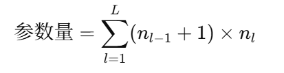

                其中 +1 来自偏置项。

下面，我们以图 7 中的三层 MLP 为例，详细写出 MLP 中由输入计算得到输出的过程。设第i层的权重、偏置和激活函数分别为，和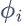。那么对于输入(输入是一个 3 维的实数向量，有\(x1, x2, x3\)三个分量)，该 MLP 进行的运算依次为：

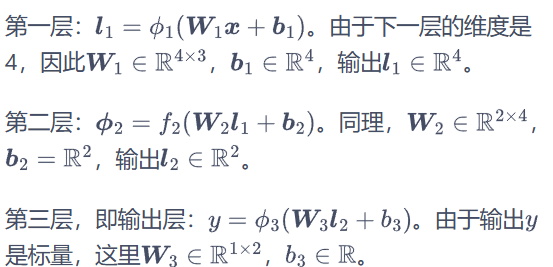


                                                                                图 7 三层的MLP运算过程

如果把上面三层所做的运算连起来写，就得到：

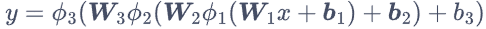

那么这些激活函数能否就用线性函数来实现，还是说一定得是非线性函数呢？我们可以做以下简单推导：假如所有的激活函数都是线性函数，即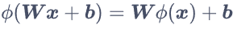，

那么上式就会变为：

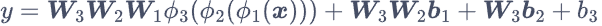

这与一个权重，偏置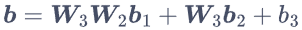，激活函数为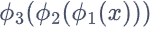的单层感知机完全一致。这样的多层感知机仅在线性意义上提高了网络的表达能力，仍然是在用多个超平面来对样本进行分割。因此，激活函数一定得是非线性的，才能使网络模型有更广的拟合能力。目前，常用的激活函数有：

* sigmoid 函数：在上一节已经介绍过，会将映射到区间内。直观上，可以将 0 对应生物神经元的静息状态，1 对应兴奋状态。相比于示性函数，逻辑斯谛函数更加平滑，并且易于求导。softmax 是 sigmoid 的多分类推广形式；两者的数值性质不同，softmax 输出的是概率分布（归一化），而 sigmoid 是独立二分类概率。

* 双曲正切（tanh）函数：。该函数将映射到，图像如图 8 所示，与逻辑斯谛函数均为“S”形曲线，同样常用与分类任务。


                                            图 8 双曲正切函数的图像

* 线性整流单元（rectified linear unit，ReLU）：。该函数将小于 0 的输入都变成 0，而大于 0 的输入保持原样，图像如图 9 所示。虽然函数的两部分都是线性的，但在大于 0 的部分并不像示性函数一样是常数，因此存在梯度，并且保持了原始的输入信息。一些研究表明，ReLU 函数将大约一半的神经元输出设置为 0、即静息状态的做法，与生物神经元有相似之处。


                                                            图 9 ReLU函数的图像

在实践中，考虑到不同隐含层之间的对称性，我们一般让所有隐含层的激活函数相同。而 ReLU 函数作为计算最简单、又易于求导的选择，在绝大多数情况下都被用作隐含层的激活函数。输出层的激活函数与任务对输出的要求直接相关，需要根据不同的任务而具体选择。例如，二分类问题可以选用逻辑斯谛函数，多分类问题可以选用 softmax 函数，要求输出在区间内的问题可以选用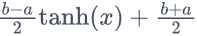。MLP 相比于单层感知机的表达能力提升，关键就在于非线性激活函数的复合。理论上可以证明，任意一个上的连续函数，都可以由大小合适的 MLP 来拟合，而对其非线性激活函数的形式要求很少。该定理称为**普适逼近定理**，为神经网络的有效性给出了最基础的理论保证。

从上面的分析中可以看出，非线性部分对提升模型的表达能力十分重要。事实上，非线性变换相当于提升了数据的维度。例如二维平面上的点，经过变换，就可以看作三维空间中的点。原本在同一平面上的点经过这样的非线性变换，就分布到三维空间中去了。但如果变换是线性的，原本在同一平面上的点变换后在空间中仍然位于同一平面上，只不过是所处的平面做了平移、旋转。虽然看上去这些点也在三维空间，但本质上来说，数据间的相对位置关系并没有改变。因此，线性变换对提升模型的表达能力没有太大帮助，而连续的线性变换如上面的推导所示，还可以合并成一个线性变换。

数据维度提升的好处在于，在低维空间中线性不可分的数据，经过合适的非线性变换，在高维空间中可能变得线性可分。例如，在前文描述的异或问题中，我们通过某种非线性变换，将原本在平面上的 4 个点映射到三维空间去。如图10 所示，右边的绿色平面是平面，箭头表示将原本二维的点变换到三维。在变换过后，就可以用来直接对样本进行分类。因此，MLP 中要不断通过非线性的激活函数提升数据的维度，从而提升表达能力。


                                                                                        图10 三维空间中的异或问题

-----------------------------------------------------------------------------------------

为了调整多层感知机的参数，训练神经网络，设最小化的目标函数为，我们依然需要计算目标函数对网络中各个参数的梯度。对于前馈网络来说，其每一层的计算是依次进行的。以上文的三层 MLP 为例，按照梯度计算的链式法则，可以得到：

                                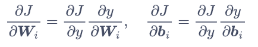

比照图 11，对参数和的梯度可以从后向前依次计算得：

                                        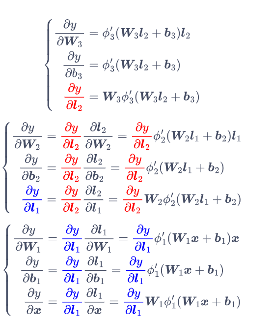


                                                  图 11 梯度的反向传播

在计算过程中，我们用同样的颜色标出了重复的部分。需要注意，某些时候输入也会变成可以优化的参数，因此上式最后我们也写出了对输入求导的结果。按照这样的顺序，我们在最后一层计算出的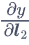，可以直接用在倒数第二层的梯度计算上，以此类推。因此，每一层的梯度由两部分组成。一部分是当前的激活函数计算出的梯度，另一部分是后一层回传的梯度。像这样梯度由后向前传播的算法，就称为反向传播（back propagation，BP）算法，该算法是现代神经网络训练的核心之一。从图中也可以看出，网络计算输出时的绿色数据流向和损失函数求导时的红色梯度流向恰好相反。从数学的角度来讲，反向传播算法成立的根本原因是链式求导法则，从而靠后的层计算得到的结果可以在靠前的层中反复使用，无须在每一层都从头计算，大大提高了梯度计算的效率。

最后，设学习率为，我们可以根据梯度下降算法更新网络的参数：


* * *

> **小故事**：神经网络的雏形出现于 1943 年，它最初是由神经生理学家麦卡洛克和数学家皮兹为建立人类神经元活动的数学模型而提出的。接下来，罗森布拉特在 1958 年提出了感知机，这时的感知机只有一层，结构较为简单，本质上仍然是线性模型，无法解决包括异或问题在内的非线性问题。到了 1965 年，阿列克谢·伊瓦赫年科（Alexey Ivakhnenko）和瓦连京·拉帕（Valentin Lapa）提出了多层感知机的概念，大大提升了神经网络的表达能力。1982 年，保罗·韦伯斯（Paul Werbos）将反向传播算法应用到多层感知机上，改善了网络训练的问题。此时的 MLP 已经具有了现代神经网络的一些特点，例如反向传播、梯度下降优化等等。然而，相比于同时代的支持向量机（将在第 11 章中介绍），MLP 的数学解释模糊，很难通过数学方法保证其性能，另外神经网络模型的训练需要消耗大量计算资源。而支持向量机数学表达优美，逻辑严谨，计算简单，深受研究者的喜爱。因此，神经网络方面的研究陷入了长时间的沉寂。
> 
> 2010 年左右，随着计算机硬件的进步与 GPU 算力的提升，神经网络重新出现在人们的视野中，对它的研究也慢慢增多。2012 年，用于图像分类的深度神经网络 AlexNet（将在第 9 章中介绍）在 ImageNet 比赛中以巨大优势取得了第一名，瞬间点燃了深度神经网络研究的热情。自此以后，机器学习进入了深度学习时代，深度神经网络及其各种应用成为了机器学习的绝对主流。今天，在许多领域，神经网络模型完成智能任务的水平已经超越了人类，例如 AlphaGo、AlphaFold、DALL-E、ChatGPT，越来越多的神经网络模型在不断刷新着我们对人工智能的认知。

* * *

8.5 动手实现多层感知机
-------------------------------------------------------------------------------------------------------------------------------------------

接下来，我们先手动实现简单的 MLP 与反向传播算法，再讲解如何使用 PyTorch 库中的工具直接构造 MLP。首先，我们导入必要的库和数据集。本次使用的数据集 xor_dataset.csv 是异或数据集，与上文描述的离散异或问题稍有不同，该数据集包含了平面上连续的点。坐标为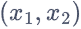的点的标签是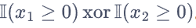。因此，当样本在第一、三象限时，其标签为 0；在第二、四象限时标签为 1。数据分布和标签如图 12 所示。每一行数据包含 3 个值，依次为样本的x1,x2，和标签y。


                                                        图 12 异或数据集中的样本分布

```python


import numpy as np

import matplotlib.pyplot as plt

# 导入数据集

data = np.loadtxt('xor_dataset.csv', delimiter=',')

print('数据集大小：', len(data))

print(data[:5])

# 划分训练集与测试集

ratio = 0.8

split = int(ratio * len(data))

np.random.seed(0)

data = np.random.permutation(data)

# y的维度调整为(len(data), 1)，与后续模型匹配

x_train, y_train = data[:split, :2], data[:split, -1].reshape(-1, 1)

x_test, y_test = data[split:, :2], data[split:, -1].reshape(-1, 1)
```

数据集大小： 1000

[[ 1.7641  0.4002  0.    ]

 [ 0.9787  2.2409  0.    ]

 [ 1.8676 -0.9773  1.    ]

 [ 0.9501 -0.1514  1.    ]

 [-0.1032  0.4106  1.    ]]

接下来，我们开始实现 MLP 中的具体内容。由于 MLP 的前馈结构，我们可以将其拆分成许多层。每一层都应当具备 3 个基本的功能：根据输入计算输出，计算参数的梯度，更新层参数。激活函数可以抽象为单独的一层，不具有参数。为了形式统一，我们先定义基类，再让不同的层都继承基类。

# 基类

```python
class Layer:
    # 前向传播函数，根据输入x计算该层的输出y

    def forward(self, x):

        raise NotImplementedError

    # 反向传播函数，输入上一层回传的梯度grad，输出当前层的梯度

    def backward(self, grad):

        raise NotImplementedError

    # 更新函数，用于更新当前层的参数

    def update(self, learning_rate):

        pass
```

线性层是 MLP 中最基本的结构之一，其参数为W和b，输入与输出关系为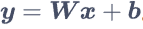。由于其结构相当于将前后的神经元两两都连接起来，因此又称为全连接层。

```python
class Linear(Layer):
    def __init__(self, num_in, num_out, use_bias=True):

        self.num_in = num_in # 输入维度

        self.num_out = num_out # 输出维度

        self.use_bias = use_bias # 是否添加偏置

        # 参数的初始化非常重要

        # 如果把参数默认设置为0，会导致Wx=0，后续计算失去意义

        # 我们直接用正态分布来初始化参数

        self.W = np.random.normal(loc=0, scale=1.0, size=(num_in, num_out))

        if use_bias: # 初始化偏置

            self.b = np.zeros((1, num_out))

    def forward(self, x):

        # 前向传播y = Wx + b

        # x的维度为(batch_size, num_in)

        self.x = x

        self.y = x @ self.W # y的维度为(batch_size, num_out)

        if self.use_bias:

            self.y += self.b

        return self.y

    def backward(self, grad):

        # 反向传播，按照链式法则计算

        # grad的维度为(batch_size, num_out)

        # 梯度要对batch_size取平均

        # grad_W的维度与W相同，为(num_in, num_out)

        self.grad_W = self.x.T @ grad / grad.shape[0]

        if self.use_bias:

            # grad_b的维度与b相同，为(1, num_out)

            self.grad_b = np.mean(grad, axis=0, keepdims=True)

        # 向前传播的grad维度为(batch_size, num_in)

        grad = grad @ self.W.T

        return grad

    def update(self, learning_rate):

        # 更新参数以完成梯度下降

        self.W -= learning_rate * self.grad_W

        if self.use_bias:

            self.b -= learning_rate * self.grad_b
```

除了线性部分以外，MLP 中还有非线性激活函数。这里我们只实现上文讲到的sigmoid函数、tanh 函数和 ReLU 函数 3 种激活函数。为了将其应用到 MLP 中，除了其表达式，我们还需要知道其梯度，以计算反向传播。它们的梯度分别为：

* 逻辑斯谛函数：在逻辑斯谛回归一章中已经介绍过，这里直接给出结果：
  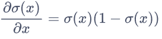

* tanh 函数：
  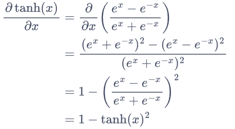

* ReLU 函数：这是一个分段函数，因此其梯度也是分段的，为： 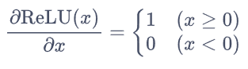

* 事实上，在处的梯度并不存在。但为了计算方便，我们人为定义其梯度与右方连续，值为 1。

除此之外，我们有时希望激活函数不改变层的输出，因此我们再额外实现恒等函数（identity function）。这些激活函数都没有具体的参数，因此在实现时`update`留空，只需要完成前向和反向传播即可。

```python
class Identity(Layer):
    # 单位函数

    def forward(self, x):

        return x

    def backward(self, grad):

        return grad

class Sigmoid(Layer):
    # Sigmoid函数

    def forward(self, x):

        self.x = x

        self.y = 1 / (1 + np.exp(-x))

        return self.y

    def backward(self, grad):

        return grad * self.y * (1 - self.y)

class Tanh(Layer):
    # tanh函数

    def forward(self, x):

        self.x = x

        self.y = np.tanh(x)

        return self.y

    def backward(self, grad):

        return grad * (1 - self.y ** 2)

class ReLU(Layer):
    # ReLU函数

    def forward(self, x):

        self.x = x

        self.y = np.maximum(x, 0)

        return self.y

    def backward(self, grad):

        return grad * (self.x >= 0)

# 存储所有激活函数和对应名称，方便索引

activation_dict = {
    'identity': Identity,

    'sigmoid': Sigmoid,

    'tanh': Tanh,

    'relu': ReLU

}

#最后，将全连接层和激活函数层依次拼起来，就可以得到一个简单的 MLP 了。

class MLP:
    def __init__(

        self,

        layer_sizes, # 包含每层大小的list

        use_bias=True,

        activation='relu',

        out_activation='identity'

    ):

        self.layers = []

        num_in = layer_sizes[0]

        for num_out in layer_sizes[1: -1]:

            # 添加全连接层

            self.layers.append(Linear(num_in, num_out, use_bias))

            # 添加激活函数

            self.layers.append(activation_dict[activation]())

            num_in = num_out

        # 由于输出需要满足任务的一些要求

        # 例如二分类任务需要输出[0,1]之间的概率值

        # 因此最后一层通常做特殊处理

        self.layers.append(Linear(num_in, layer_sizes[-1], use_bias))

        self.layers.append(activation_dict[out_activation]())

    def forward(self, x):

        # 前向传播，将输入依次通过每一层

        for layer in self.layers:

            x = layer.forward(x)

        return x

    def backward(self, grad):

        # 反向传播，grad为损失函数对输出的梯度

        # 将该梯度依次回传，得到每一层参数的梯度

        for layer in reversed(self.layers):

            grad = layer.backward(grad)

    def update(self, learning_rate):

        # 更新每一层的参数

        for layer in self.layers:

            layer.update(learning_rate)
```

最后，我们可以直接将封装好的 MLP 当作一个黑盒子使用，并用梯度下降法进行训练。在本例中，异或数据集属于二分类任务，因此我们采用交叉熵损失，具体的训练过程如下。

```python
# 设置超参数

num_epochs = 1000

learning_rate = 0.1

batch_size = 128

eps=1e-7 # 用于防止除以0、log(0)等数学问题

# 创建一个层大小依次为[2, 4, 1]的多层感知机

# 对于二分类任务，我们用sigmoid作为输出层的激活函数，使其输出在[0,1]之间

mlp = MLP(layer_sizes=[2, 4, 1], use_bias=True, out_activation='sigmoid')

# 训练过程

losses = []

test_losses = []

test_accs = []

for epoch in range(num_epochs):
    # 我们实现的MLP支持批量输入，因此采用SGD算法

    st = 0

    loss = 0.0

    while True:

        ed = min(st + batch_size, len(x_train))

        if st >= ed:

            break

        # 取出batch

        x = x_train[st: ed]

        y = y_train[st: ed]

        # 计算MLP的预测

        y_pred = mlp.forward(x)

        # 计算梯度∂J/∂y

        grad = (y_pred - y) / (y_pred * (1 - y_pred) + eps)

        # 反向传播

        mlp.backward(grad)

        # 更新参数

        mlp.update(learning_rate)

        # 计算交叉熵损失

        train_loss = np.sum(-y * np.log(y_pred + eps) \

            - (1 - y) * np.log(1 - y_pred + eps))

        loss += train_loss

        st += batch_size

    losses.append(loss / len(x_train))

    # 计算测试集上的交叉熵和精度

    y_pred = mlp.forward(x_test)

    test_loss = np.sum(-y_test * np.log(y_pred + eps) \

        - (1 - y_test) * np.log(1 - y_pred + eps)) / len(x_test)

    test_acc = np.sum(np.round(y_pred) == y_test) / len(x_test)

    test_losses.append(test_loss)

    test_accs.append(test_acc)

print('测试精度：', test_accs[-1])

# 将损失变化进行可视化

plt.figure(figsize=(16, 6))

plt.subplot(121)

plt.plot(losses, color='blue', label='train loss')

plt.plot(test_losses, color='red', ls='--', label='test loss')

plt.xlabel('Step')

plt.ylabel('Loss')

plt.title('Cross-Entropy Loss')

plt.legend()

plt.subplot(122)

plt.plot(test_accs, color='red')

plt.ylim(top=1.0)

plt.xlabel('Step')

plt.ylabel('Accuracy')

plt.title('Test Accuracy')

plt.show()
```

测试精度： 0.97


                                                                                            6 用 PyTorch 库实现多层感知机

-------------------------------------------------------------------------------------------------------------------------------------------------------------

下面，我们用另一个常见的机器学习库 PyTorch 来实现 MLP 模型。PyTorch 是一个功能强大的机器学习框架，包含完整的机器学习训练模块和机器自动求梯度功能。因此，我们只需要实现模型从输入到输出、再计算损失函数的过程，就可以用 PyTorch 内的工具自动计算损失函数的梯度，再用梯度下降算法更新参数，省去了繁琐的手动计算过程。PyTorch 由于其功能强大、结构简单，是目前最常用的机器学习框架之一。在 PyTorch 中，MLP 需要用到的层和激活函数都已提供好，我们只需按照 8.5 节中类似的方法将其组合在一起就可以了。

```python
import torch # PyTorch库

import torch.nn as nn # PyTorch中与神经网络相关的工具

from torch.nn.init import normal_ # 正态分布初始化

torch_activation_dict = {
    'identity': lambda x: x,

    'sigmoid': torch.sigmoid,

    'tanh': torch.tanh,

    'relu': torch.relu

}

# 定义MLP类，基于PyTorch的自定义模块通常都继承nn.Module

# 继承后，只需要实现forward函数，进行前向传播

# 反向传播与梯度计算均由PyTorch自动完成

class MLP_torch(nn.Module):
    def __init__(

        self,

        layer_sizes, # 包含每层大小的list

        use_bias=True,

        activation='relu',

        out_activation='identity'

    ):

        super().__init__() # 初始化父类

        self.activation = torch_activation_dict[activation]

        self.out_activation = torch_activation_dict[out_activation]

        self.layers = nn.ModuleList() # ModuleList以列表方式存储PyTorch模块

        num_in = layer_sizes[0]

        for num_out in layer_sizes[1:]:

            # 创建全连接层

            self.layers.append(nn.Linear(num_in, num_out, bias=use_bias))

            # 正态分布初始化，采用与前面手动实现时相同的方式

            normal_(self.layers[-1].weight, std=1.0)

            # 偏置项为全0

            self.layers[-1].bias.data.fill_(0.0)

            num_in = num_out

    def forward(self, x):

        # 前向传播

        # PyTorch可以自行处理batch_size等维度问题

        # 我们只需要让输入依次通过每一层即可

        for i in range(len(self.layers) - 1):

            x = self.layers[i](x)

            x = self.activation(x)

        # 输出层

        x = self.layers[-1](x)

        x = self.out_activation(x)

        return x

#最后，定义超参数，用相同的方式训练 PyTorch 模型，最终得到的结果与手动实现的相近。

# 设置超参数

num_epochs = 1000

learning_rate = 0.1

batch_size = 128

eps = 1e-7

torch.manual_seed(0)

# 初始化MLP模型

mlp = MLP_torch(layer_sizes=[2, 4, 1], use_bias=True,
    out_activation='sigmoid')

# 定义SGD优化器

opt = torch.optim.SGD(mlp.parameters(), lr=learning_rate)

# 训练过程

losses = []

test_losses = []

test_accs = []

for epoch in range(num_epochs):
    st = 0

    loss = []

    while True:

        ed = min(st + batch_size, len(x_train))

        if st >= ed:

            break

        # 取出batch，转为张量

        x = torch.tensor(x_train[st: ed],

            dtype=torch.float32)

        y = torch.tensor(y_train[st: ed],

            dtype=torch.float32).reshape(-1, 1)

        # 计算MLP的预测

        # 调用模型时，PyTorch会自动调用模型的forward方法

        # y_pred的维度为(batch_size, layer_sizes[-1])

        y_pred = mlp(x)

        # 计算交叉熵损失

        train_loss = torch.mean(-y * torch.log(y_pred + eps) \

            - (1 - y) * torch.log(1 - y_pred + eps))

        # 清空梯度

        opt.zero_grad()

        # 反向传播

        train_loss.backward()

        # 更新参数

        opt.step()

        # 记录累加损失，需要先将损失从张量转为numpy格式

        loss.append(train_loss.detach().numpy())

        st += batch_size

    losses.append(np.mean(loss))

    # 计算测试集上的交叉熵

    # 在不需要梯度的部分，可以用torch.inference_mode()加速计算

    with torch.inference_mode():

        x = torch.tensor(x_test, dtype=torch.float32)

        y = torch.tensor(y_test, dtype=torch.float32).reshape(-1, 1)

        y_pred = mlp(x)

        test_loss = torch.sum(-y * torch.log(y_pred + eps) \

            - (1 - y) * torch.log(1 - y_pred + eps)) / len(x_test)

        test_acc = torch.sum(torch.round(y_pred) == y) / len(x_test)

        test_losses.append(test_loss.detach().numpy())

        test_accs.append(test_acc.detach().numpy())

print('测试精度：', test_accs[-1])

# 将损失变化进行可视化

plt.figure(figsize=(16, 6))

plt.subplot(121)

plt.plot(losses, color='blue', label='train loss')

plt.plot(test_losses, color='red', ls='--', label='test loss')

plt.xlabel('Step')

plt.ylabel('Loss')

plt.title('Cross-Entropy Loss')

plt.legend()

plt.subplot(122)

plt.plot(test_accs, color='red')

plt.ylim(top=1.0)

plt.xlabel('Step')

plt.ylabel('Accuracy')

plt.title('Test Accuracy')

plt.show()
```

测试精度： 0.965


7 小结

-----------------------------------------------------------------------------------------

人工神经网络是深度学习的基础，而现代人工智能的大部分应用都涉及深度学习。可以说，现在一切实用的人工智能模型都包含了不同结构的神经网络。本章讲解了神经网络的发展历程，以及一个曾经得到大规模应用的重要神经网络模型——多层感知机。其中包含的前馈结构、反向传播等思想，深刻地影响了后续神经网络的发展。
--------------------------------------------------------------

🌟 Hugging Face Transformers 常用组件（[官方文档](https://huggingface.co/docs)）
============================================

* * *

一、模型下载
----------------------------

```python
from huggingface_hub import snapshot_download

# 例如下载 LLaMA 或 Qwen 模型
repo_id = "Qwen/Qwen2-1.5B"

# 下载整个模型仓库到本地
local_dir = snapshot_download(repo_id=repo_id)

print("模型下载到：", local_dir)

```

## 二、`AutoTokenizer` —— 自动加载分词器

----------------------------

将原始文本转换成模型可以理解的 token ID。

```python
    from transformers import AutoTokenizer

    # 从 Hugging Face Hub 下载并加载一个预训练分词器（以 BERT 为例）
    tokenizer = AutoTokenizer.from_pretrained("bert-base-uncased")

    # 原始输入文本
    text = "Hugging Face is awesome!"

    # 编码：将文本转成 token ID，return_tensors="pt" 表示返回 PyTorch 张量格式
    encoded = tokenizer(text, return_tensors="pt")

    # 打印编码后的结果（字典形式，包括 input_ids 和 attention_mask）
    print("编码结果：", encoded)

    # 解码：将 token ID 转回可读文本
    decoded = tokenizer.decode(encoded["input_ids"][0])
    print("解码结果：", decoded)
```

📘 **说明**

* `input_ids`：词语对应的索引序列

* `attention_mask`：标识哪些 token 是有效的（1）或填充的（0）

* `decode()`：将 token ID 序列还原成人类可读文字

* * *

三、`AutoModel` / `AutoModelForSequenceClassification` —— 加载模型
------------------------------------------------------------

```python
    from transformers import AutoModelForSequenceClassification

    # 自动加载一个用于文本分类的预训练模型
    model = AutoModelForSequenceClassification.from_pretrained("bert-base-uncased", num_labels=2)

    # 打印模型结构
    print(model)
```

📘 **说明**

* `AutoModel`：仅加载 Transformer 主体，不带分类头；

* `AutoModelForSequenceClassification`：加载适合分类任务的模型；

* `num_labels`：类别数量（如 2 表示正负分类）。

* * *

四、`pipeline` —— 快速任务接口
----------------------

```python
    from transformers import pipeline

    # 创建一个情感分析 pipeline
    classifier = pipeline("sentiment-analysis")

    # 输入一句话
    result = classifier("I love Hugging Face!")
    print(result)
```

📘 **说明**

* `pipeline` 会自动加载模型和分词器；

* 内置任务如：
  
  * `"sentiment-analysis"`（情感分类）
  
  * `"translation"`（翻译）
  
  * `"text-generation"`（文本生成）
  
  * `"summarization"`（摘要生成）
  
  * `"question-answering"`（问答）

* 输出通常为一个字典列表，包含 `label` 和 `score`。

* * *

五、`Trainer` 与 `TrainingArguments` —— 快速训练模型
-------------------------------------------

```python
    from transformers import AutoTokenizer, AutoModelForSequenceClassification, Trainer, TrainingArguments
    from datasets import load_dataset

    #  加载示例数据集（IMDb 影评情感分类）
    dataset = load_dataset("imdb")

    #  加载分词器
    tokenizer = AutoTokenizer.from_pretrained("bert-base-uncased")

    # 定义分词函数
    def tokenize_fn(batch):
        # truncation=True 截断过长文本，padding="max_length" 补齐长度
        return tokenizer(batch["text"], padding="max_length", truncation=True)

    # 应用到整个数据集
    dataset = dataset.map(tokenize_fn, batched=True)

    # 设置 PyTorch 格式字段
    dataset.set_format("torch", columns=["input_ids", "attention_mask", "label"])

    #  加载模型
    model = AutoModelForSequenceClassification.from_pretrained("bert-base-uncased", num_labels=2)

    #  训练参数配置
    args = TrainingArguments(
        output_dir="./results",             # 输出路径
        evaluation_strategy="epoch",        # 每个 epoch 进行评估
        learning_rate=2e-5,                 # 学习率
        per_device_train_batch_size=8,      # 每个 GPU 的 batch size
        num_train_epochs=1,                 # 训练轮数
        logging_dir="./logs",               # 日志保存位置
    )

    #  创建 Trainer 实例
    trainer = Trainer(
        model=model,
        args=args,
        train_dataset=dataset["train"].select(range(1000)),  # 仅使用前1000条作为示例
        eval_dataset=dataset["test"].select(range(200)),     # 使用前200条测试数据
    )

    # 开始训练
    trainer.train()
```

📘 **说明**

* `Trainer` 封装了完整的训练循环；

* 自动处理梯度更新、日志记录、验证集评估；

* 适用于快速实验和 fine-tuning。

* * *

六、`generate()` —— 文本生成（GPT 类模型）
-------------------------------

```python
    from transformers import AutoTokenizer, AutoModelForCausalLM

    # 加载 GPT2 模型和分词器
    tokenizer = AutoTokenizer.from_pretrained("gpt2")
    model = AutoModelForCausalLM.from_pretrained("gpt2")

    # 输入提示语（prompt）
    prompt = "In the future, AI will"

    # 编码输入
    inputs = tokenizer(prompt, return_tensors="pt")

    # 使用 generate() 进行文本生成
    outputs = model.generate(
        **inputs,
        max_new_tokens=30,     # 最多生成 30 个新 token
        temperature=0.8,       # 控制随机性（越高越随机）
        top_p=0.9,             # nucleus sampling 截断低概率词
    )

    # 解码输出
    print(tokenizer.decode(outputs[0], skip_special_tokens=True))
```

📘 **说明**

* `generate()` 是所有生成任务的核心；

* `temperature` 控制输出多样性；

* `top_p` 控制生成采样策略。

* * *

七、`Config` —— 模型配置对象
--------------------

```python
    from transformers import AutoConfig

    # 加载配置文件
    config = AutoConfig.from_pretrained("bert-base-uncased")

    # 打印部分参数
    print("隐藏层维度：", config.hidden_size)
    print("注意力头数：", config.num_attention_heads)
    print("层数：", config.num_hidden_layers)
```

📘 **说明**

* `AutoConfig` 可查看模型架构参数；

* 也可修改并保存自定义配置再重新训练。

* * *

八、`datasets` —— 数据集加载与处理
------------------------

```python
    from datasets import load_dataset

    # 加载内置 SQuAD 问答数据集
    dataset = load_dataset("squad")

    # 打印一条数据
    print(dataset["train"][0])
```

📘 **说明**

* `datasets` 支持直接下载上百个标准数据集；

* 也支持 `.csv` / `.json` / `.parquet` 本地数据；

* 自动缓存与切分（train/test）。

* * *

九、`peft` —— 参数高效微调（LoRA 示例）
---------------------------

```python
    from peft import LoraConfig, get_peft_model
    from transformers import AutoModelForCausalLM

    # 加载模型
    model = AutoModelForCausalLM.from_pretrained("gpt2")

    # 配置 LoRA 参数
    peft_config = LoraConfig(
        r=8,                          # 低秩分解维度
        lora_alpha=32,                # 缩放因子
        target_modules=["c_attn"],    # 指定微调模块
        lora_dropout=0.1,             # dropout 概率
        bias="none"
    )

    # 将原模型包装为 PEFT 模型
    model = get_peft_model(model, peft_config)

    # 查看可训练参数
    model.print_trainable_parameters()
```

📘 **说明**

* LoRA 仅训练少量新增参数（极大减少显存占用）；

* 可与 `Trainer` 结合使用。

* * *

总结一览表
==========

| 模块                | 主要作用     | 示例函数                             |
| ----------------- | -------- | -------------------------------- |
| `AutoTokenizer`   | 文本编码/解码  | `tokenizer(text)`                |
| `AutoModelForXXX` | 加载特定任务模型 | `.from_pretrained()`             |
| `pipeline`        | 快速推理     | `pipeline("sentiment-analysis")` |
| `Trainer`         | 训练与评估    | `trainer.train()`                |
| `generate()`      | 文本生成     | `model.generate()`               |
| `Config`          | 模型参数配置   | `AutoConfig.from_pretrained()`   |
| `datasets`        | 加载数据     | `load_dataset("imdb")`           |
| `peft`            | 参数高效微调   | `get_peft_model()`               |

* * *

# 🌟作业

### 1.运行homework文件夹里面的代码，并理解每一步的具体作用

### 2.尝试自己通过python程序的形式与模型对话

### 运行结果加上学号姓名发3234786943@qq.com
