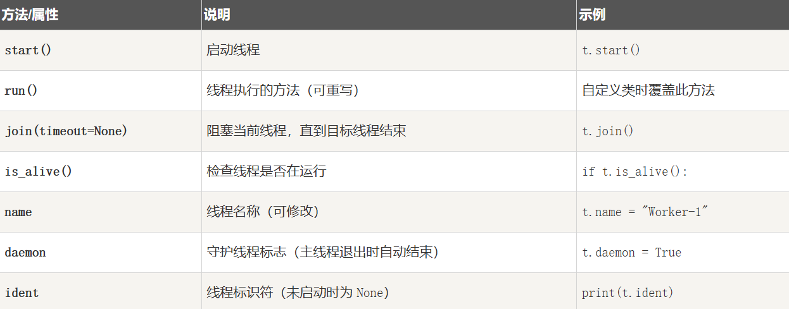
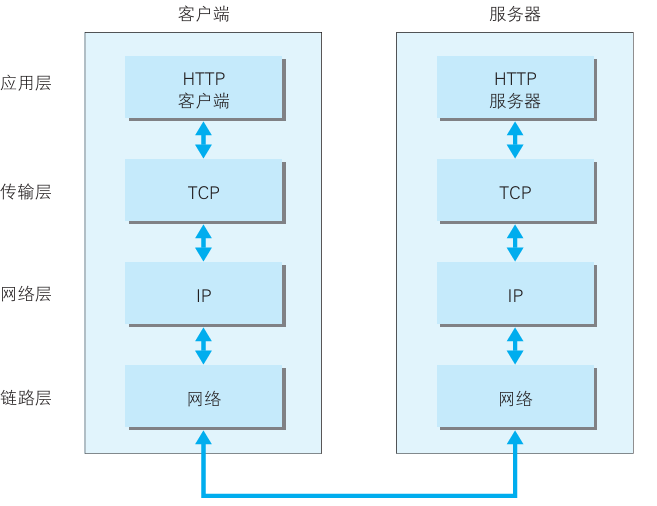

### 包管理工具

#### 为什么需要包管理工具？

在使用 Python 开发时，我们经常需要安装别人写好的功能库（比如`numpy`、`torch`、`huggingface_hub` 等）。
 这些库被称为 **包（Package）**。

但是随着项目变大，我们会遇到：

- 不同项目需要不同版本的包
- 环境混乱，包版本冲突
- 重新部署项目时依赖太多

简单说，包管理工具就是为了方便地安装、更新、卸载和**管理第三方包**与**环境**

#### pip

`pip` 是 Python 自带的包管理器，从 Python 3.4 起自动安装。
 它从 **PyPI（Python Package Index）** 上下载并安装包。

```
# 基本命令
# 安装包
pip install package_name

# 卸载包
pip uninstall package_name

# 查看已安装的包
pip list

# 查看指定包信息
pip show package_name

# 导出依赖列表
pip freeze > requirements.txt

# 根据依赖文件安装
pip install -r requirements.txt
```

pip设置的默认源是官方源：https://pypi.org/simple ，没挂vpn的话可以手动换源

#### 虚拟环境

当我们在同一台电脑上开发多个 Python 项目时，经常会遇到这样的情况：

- 项目 A 需要 `flask==2.1.0`
- 项目 B 需要 `flask==3.0.0`

如果所有项目都共用一个全局环境（`python`的默认安装环境），
 就会导致包版本冲突、程序无法运行。

**虚拟环境** 就是为每个项目创建一个**独立的 Python 环境**，
 它有自己独立的包目录，不会影响系统或其他项目。

```
# 在当前目录创建虚拟环境
python -m venv .venv

# 激活虚拟环境
# Windows：
.venv\Scripts\activate

# macOS / Linux：
source .venv/bin/activate
```

##### 使用**conda**管理虚拟环境:

`conda`是由Anaconda公司开发的工具，不仅可以安装包，还能管理不同的Python环境。

它使用自己的仓库（而不是 PyPI），里面的包通常已经编译好，安装更快。

```
#基本命令，在这里只写最常用的两条
# 创建一个新环境
conda create -n your_env_name python=3.10
# 激活环境
conda activate your_env_name
```

安装conda的部分见 **class0**

（简短不说废话，这次课件里只提供一个最简单的虚拟环境和包管理方案，方便大家轻松上手）

熟悉简单的环境和包管理流程后可以看个人习惯选择其它的包管理方案，这里使用方法不赘述，贴个官方文档地址

uv:[https://docs.astral.sh/uv/](https://docs.astral.sh/uv/?utm_source=chatgpt.com)

Poetry:https://python-poetry.org/docs/

### 并发

**并发**是大幅提高Python程序性能的一种方法，在Python中我们通常有三个库选项来实现并发： multiprocessing, threading, asyncio

#### 进程，线程，协程

##### 进程（Process）

- 一个程序在操作系统中运行时，会被操作系统分配一个 **“进程”**。一个“正在运行的程序本体”，有自己的一整套资源（比如自己的内存、文件、网络连接）
- 每个进程都有**完全独立的空间**，互相之间默认互不影响。你双击打开一个软件，就相当于“创建了一个进程”。

##### 线程（Thread）

- 在一个进程内部，可以有多个 **“线程”**，同进程的线程可以直接共享数据。
- 线程的好处在于：**创建线程**和**线程之间切换**的开销比进程小，适合将一个进程内部拆成多个并发运行的任务

##### 协程（Coroutine）

- 协程更像“非常轻量的小任务”，它们不是靠操作系统调度，而是靠程序自己**自觉让出**执行权。
- 协程切换所需资源更少，因为无需像线程那样进入操作系统内核调度，也不需要线程那样多的上下文切换成本。适合大量 I/O 操作（如网络请求、文件读写）时大规模并发

#### 基于线程的并发

##### threading 模块

**threading**模块是用于实现多线程编程的标准库之一，多线程允许程序在同一时间内执行多个任务

在本教程中我们通过继承`Thread`类来创建线程

```python
# 继承
class MyThread(threading.Thread):
    def run(self):
        print("线程开始执行")
        # 在这里编写线程要执行的代码
        print("线程执行结束")
# 创建线程实例:
thread = MyThread()

# 或直接使用threading.Thread类：:
#thread = threading.Thread(target=my_function)

# 启动线程
thread.start()
# 等待线程执行完毕
thread.join()
print("主线程结束")
```

在这里我们继承了threading.Thread类，创建了MyThread子类并重写了run方法,Thread常用方法/属性贴在这里：



这样我们就可以写一个简单的多线程：

```python
import threading
import time

class Mythread (threading.Thread):
    def __init__(self, threadID, name):  #__init__方法上图没有写，但也是Thread这个类里的
        threading.Thread.__init__(self)
        self.threadID = threadID
        self.name = name

    def run(self):
        print(f"开始执行线程{self.name}")
        print_time(self.threadID, 5)
        print(f"结束线程{self.name}")

def print_time(threadID, counter):
    while counter:
        time.sleep(1)
        print(f"线程{threadID}:{time.ctime(time.time())}")  # 打印当前时间
        counter -= 1

thread1 = Mythread(1, "Thread-1")  # 创建线程实例
thread2 = Mythread(2, "Thread-2")
thread1.start()
thread2.start()
thread1.join()
thread2.join()
print(f"退出主线程")
```

在这个demo里你可以看到，thread1，thread2两个线程是处于**并发**执行状态的

由于 Python 的全局解释器锁（GIL）限制，同一时刻只有一个线程在执行 Python 代码。
但当线程执行 I/O 操作（如 `time.sleep()`）时，解释器会释放 GIL，使其他线程可以运行，因此两个线程看起来像是“同时”在打印输出

##### 线程同步

我们看到，多个线程可以同时执行任务，但如果这些线程要访问同一个共享资源（比如同一个文件、同一个变量），就可能出现**数据竞争（race condition）**。

```python
#比如把上个demo的print_time改为操作全局变量count:
#import略
count = 1

class Mythread (threading.Thread):
    #__init__不变

    def run(self):
        global count
        print(f"开始执行线程{self.name}")
        for i in range(5):
            print_count(self.threadID)
            count += 1  # 这样多个线程会对同一个变量进行修改
            time.sleep(1)
        print(f"结束线程{self.name}")

def print_count(threadID):
    print(f"线程{threadID}：count = {count}")

#实例化和启动线程部分不变

#运行会发现，有时程序会打印这样的结果：
#线程1：count = 5
#线程2：count = 5
```

为了避免这种问题，我们需要**线程同步机制**来保证同一时间只有一个线程能访问这段关键代码——这就要用到**锁（Lock）**。

我们来尝试为上面的程序加一个简单的线程锁（调用threading库的Lock类）：

```python
#实例化线程锁
lock = threading.Lock()
#修改run的部分：
    def run(self):
        global count
        with lock:
            print(f"开始执行线程{self.name}")
            for i in range(5):
                print_count(self.threadID)
                count += 1 
                time.sleep(1)
            print(f"结束线程{self.name}")
```

运行你会发现这样虽然做到了同一时间只有一个线程访问print_count,但是看起来两个线程并没有**并发**？

这是因为这样写，表示整个**run()**方法都是**临界区**。结果是：线程按顺序依次独占锁运行完整个 run() 函数，所以看起来就像是“串行执行”。

行为**效果不同**的原因在于**使用位置**和锁的**作用范围**（粒度）。

我们来降低锁粒度：

```python
#将上面run()的部分修改：
    def run(self):
        global count
        print(f"开始执行线程{self.name}")
        for i in range(5):
            with lock: #让线程锁只作用于打印和操作count的部分
                print_count(self.threadID)
                count += 1
            time.sleep(1)
        print(f"结束线程{self.name}")
```

这样两个线程就能成功并发，也解决了数据竞争的问题

在这个demo里我们只用Lock类（互斥锁）做一个简单的线程锁来给大家感受线程同步，threading库中还提供了更多工具来实现线程同步，课下了解即可

**`Lock`（互斥锁）**：
 最基本的锁，线程拿到锁才能执行共享资源操作；其他线程必须等待锁释放。

**`RLock`（可重入锁）**：
 同一线程可以多次获得同一把锁（不会死锁）；适合递归调用或嵌套加锁场景。

**`Condition`（条件变量）**：
 让线程等待某个条件满足时再继续运行；常与 `Lock` 联用（`wait()` / `notify()`）。

**`Event`（事件）**：
 一种轻量的“信号标志”，线程通过 `wait()` 等待事件触发，`set()` 激活事件后所有等待线程被唤醒。

##### 线程间通信

**线程安全**：在多线程环境中，确保对共享资源的访问是线程安全的，避免数据竞争和死锁。

线程间通信可以通过队列（**Queue**）来实现。**Queue**是Python标准库queue模块中的一个类，它**是线程安全**的，它的内部已经实现了**锁机制（Lock）**

 queue库的常用类:

**queue.Queue(maxsize)**—— **先进先出（FIFO）** 队列

**queue.LifoQueue(maxsize)**—— **后进先出（LIFO）** 栈式队列

**queue.PriorityQueue(maxsize)** —— 带优先级的队列（元素为(priority, data)）

我们用Queue类的几个常用方法来写一个经典的demo来感受一下：

```python
import threading
import queue
import time

workQueue = queue.Queue(maxsize=10)

def producer(): # 生产者
    for i in range(10):
        workQueue.put(i)
        print(f"生产:{i}")
        time.sleep(0.4)
    print("生产结束")

def consumer(): # 消费者
    while True:
        item = workQueue.get()
        print(f"消费:{item}")
        time.sleep(1)
        workQueue.task_done()

producer_thread = threading.Thread(target=producer)
consumer_thread = threading.Thread(target=consumer,daemon=True) #守护线程

producer_thread.start()
consumer_thread.start()

producer_thread.join() # 这里的join是Thread类下的方法
workQueue.join() # 这里的join是Queue类下的方法
print("所有任务完成")
```

我们可以看到生产者不断往队列中放数据，消费者不断从队列取数据。队列自动控制同步，不需要自己加锁。

补充：Queue类的常用方法

| 方法                                  | 作用                                 | 说明                                                      |
| ------------------------------------- | ------------------------------------ | --------------------------------------------------------- |
| `qsize()`                             | 返回队列当前包含的元素数量           | 只是一个近似值（非线程安全）                              |
| `empty()`                             | 判断队列是否为空                     | 若为真，不保证之后仍然为空（多线程环境下不可靠）          |
| `full()`                              | 判断队列是否已满                     | 同上，不保证之后仍然满                                    |
| `put(item, block=True, timeout=None)` | 向队列中放入一个元素                 | 若队列已满，则阻塞；`block=False` 时立刻抛出 `queue.Full` |
| `get(block=True, timeout=None)`       | 从队列中取出一个元素                 | 若队列为空则阻塞；`block=False` 时立刻抛出 `queue.Empty`  |
| `put_nowait(item)`                    | 等价于 `put(item, block=False)`      | 立即插入，不等待                                          |
| `get_nowait()`                        | 等价于 `get(block=False)`            | 立即取出，不等待                                          |
| `task_done()`                         | 告诉队列某个任务已完成               | 必须与 `join()` 配合使用                                  |
| `join()`                              | 阻塞主线程，直到队列中所有任务都完成 | 即所有 `task_done()` 都被调用                             |

在这里我们的消费者线程是循环的，所以我们为它设置守护线程，在workQueue清空后，主程序终止，消费者线程也停止

##### 线程池

想象一下在上面的demo里，如果你需要开更多线程，每次都需要`threading.Thread(target=...)`去创建新线程

这就会导致：

- 创建与销毁线程带来**性能开销**；

- 线程太多会导致**CPU频繁切换上下文**，反而变慢；

- 不便于统一管理线程。

于是我们使用 **线程池（ThreadPoolExecutor）**：
它会**提前创建固定数量的线程**，任务来了直接从池中取一个线程执行，执行完放回去复用。

话不多说我们直接来看线程池的核心类`concurrent.futures.ThreadPoolExecutor`的主要方法

| 方法/属性                     | 作用                                          |
| ----------------------------- | --------------------------------------------- |
| `submit(fn, *args, **kwargs)` | 提交一个任务，返回一个 `Future` 对象          |
| `map(func, iterable)`         | 类似内置 `map()`，批量提交任务                |
| `shutdown(wait=True)`         | 关闭线程池（`wait=False` 表示不等待任务完成） |
| `Future.result()`             | 获取任务返回值（会阻塞直到完成）              |
| `Future.done()`               | 判断任务是否完成                              |

我们来模拟开一个线程池来处理任务：

```python
from concurrent.futures import ThreadPoolExecutor
import time

def task(name):
    print(f"任务{name}开始")
    time.sleep(1)
    print(f"任务{name}结束")
    return f"结果-{name}"

#创建一个最大同时执行3个任务的线程池
with ThreadPoolExecutor(max_workers=3) as pool:
    #提交10个任务
    futures = [pool.submit(task, i) for i in range(10)]
    #获取执行结果
    for future in futures:
        print(future.result())                
```

这样我们就完成了一个最简单的线程池demo，接下来你可以尝试为之前的的几个demo写线程池

线程池是对多线程的一种**高级封装**，相对于手动开线程，线程池通过**线程复用**机制可以更高效的管理并发任务

简单来说：**线程池让“并发任务”从“线程管理”中解放出来。**
这样我们只需关心任务逻辑，线程的创建、调度、回收都交由线程池自动完成

#### 进程池

##### 多线程 vs 多进程：并发与并行的区别

（还记得我们之前提到过CPU密集型任务吗）

- 在多线程中，看似多个线程“同时”执行，但其实它们是在 **单个 CPU 核心上快速切换执行** —— 这叫 **并发（Concurrency）**。
-  由于 Python 的 GIL（全局解释器锁），在一个进程内同一时间只能有一个线程执行 Python 字节码，因此多线程更适合 **I/O 密集型任务**（如网络请求、文件操作），而不是 CPU 计算密集任务。

- 而多进程则不同：每个进程都有独立的 Python 解释器与内存空间，能够分布在多个 CPU 核心上真正 **并行（Parallelism）** 地执行任务。
-  因此，多进程非常适合 **CPU 密集型任务**（如递归计算、图像处理、数学运算等），能显著提高性能。

##### 进程池

在现代Python项目中，**`concurrent.futures`** 模块的 `ProcessPoolExecutor`已经逐渐替代传统的`multiprocessing.Pool`，因为它接口更统一、代码更简洁、与线程池 (`ThreadPoolExecutor`) 一致，便于切换和维护。经过刚刚对线程池的学习，我们可以直接上手来写进程池：

（`ProcessPoolExecutor`也是python3.2引入的，它在底层仍然使用 `multiprocessing`，但封装得更现代、可控性更好）

```python
from concurrent.futures import ProcessPoolExecutor, as_completed
import os
import time

# 递归计算斐波那契数列（CPU 密集型）
def fibonacci(n):
    if n <= 1:
        return n
    return fibonacci(n - 1) + fibonacci(n - 2)

if __name__ == "__main__":
    numbers = [30, 31, 32, 33, 34]  # 计算较大的 n，使CPU占用高

    print(f"CPU核心数：{os.cpu_count()}")
    start = time.time()

    # 创建进程池
    with ProcessPoolExecutor(max_workers=4) as executor:
        # 提交任务
        futures = {executor.submit(fibonacci, num): num for num in numbers}

        # 等待结果
        for future in as_completed(futures): # as_completed来自concurrent.futures模块，用于按完成顺序获取任务结果
            num = futures[future]
            print(f"fibonacci({num}) = {future.result()}")
        end = time.time()
        print(f"耗时{end - start:.2f}秒")
```

使用进程池，程序会**真正并行**地在多个CPU核上计算每个斐波那契数，每个进程有独立 Python 解释器，绕过 GIL，可充分利用多核CPU，面对CPU密集型任务，尤其是耗时计算任务，优先考虑进程池

#### 异步与协程

有些场景：

- 大量网络请求、文件操作、数据库查询等 I/O 密集型任务；
- 任务非常轻量，不想频繁创建线程/进程。

传统线程池管理这些轻量 I/O 任务会有开销，而且线程切换受 GIL 调度影响。

异步 IO（asyncio）的优势：

- **协程**（coroutine）是轻量级线程，**不依赖操作系统线程**，切换开销极小。
- **单线程多任务**：一个线程就能同时处理大量 I/O 操作。
- **高性能**：适合大量并发、轻量 I/O 密集任务（如爬虫、网络服务）。

##### 协程（Coroutine）

`asyncio`通过引入异步编程模型，允许程序在等待 I/O 操作时继续执行其他任务，从而提高了程序的并发性和效率。

协程是`asyncio`的核心概念之一。它是一个特殊的函数，可以在执行过程中暂停，并在稍后恢复执行。协程通过`async def`关键字定义，并通过`await`关键字暂停执行，等待异步操作完成。

```python
import asyncio
import time

async def say_after(delay, what):
    await asyncio.sleep(delay)
    print(what)

async def main():
    print("开始")
    await asyncio.gather(
        say_after(2, "hello"),
        say_after(1, "world")
    )
    print("结束")

if __name__ == "__main__":
    start = time.time()
    asyncio.run(main()) #asyncio.run()会创建一个事件循环并指定运行的协程
    end = time.time()
    print(f"耗时: {end - start:.2f} 秒")
    
#输出顺序：开始 → world → hello → 结束
#耗时: 2.02 秒
```

直接运行这段代码，你会发现我们没有使用多线程，两个协程“同时等待”，但在 **单线程内并发执行** 

`asyncio.run()` 是你最常用的入口，它实际上做了三步：

1. **创建事件循环**
2. **把你的主协程放进事件循环里执行**
3. **所有协程执行完后，关闭事件循环**

简化示意：

```python
asyncio.run(main())

# 等价于：
loop = asyncio.new_event_loop()
loop.run_until_complete(main())
loop.close()

```

##### asyncio

经过上面的简单demo你应该已经对协程有了简单理解，简单来说：**asyncio** 是在一个线程里，用事件循环来“轮流运行”很多协程，从而实现高并发。

在继续学习之前，我们先来梳理一下：

| 名称                       | 含义                                           |
| -------------------------- | ---------------------------------------------- |
| **协程（coroutine）**      | 一种可在执行中暂停与恢复的函数，比线程轻得多   |
| **事件循环（event loop）** | 管理协程调度与切换的“调度器”                   |
| **任务（Task）**           | 对协程的进一步封装，用于追踪协程执行状态       |
| **await 关键字**           | 挂起当前协程，等待另一个异步任务完成（非阻塞） |

接下面我们来解析一下这个demo：

###### 协程函数与事件循环

```python
async def say_after(delay, what):
    await asyncio.sleep(delay)
    print(what)
#================================
asyncio.run(main())
```

- **`async def`** 定义协程函数，协程函数不会立即执行，只有被 `await` 或放入事件循环才会运行。
- **`await`** 表示协程在等待另一个异步操作
- **`asyncio.run()`** 创建事件循环并运行主协程
- `asyncio.sleep()` 是非阻塞的，CPU 可继续调度其他协程

###### 同时运行多个协程（并发）

```python
await asyncio.gather(
        say_after(2, "hello"),
        say_after(1, "world")
    )
```

使用 **`asyncio.gather()`** 可以一次启动多个协程并发运行，这两个任务看起来同时运行，但其实是事件循环在一个线程内快速切换

到这里你应该已经完全理解了这个demo，下面是异步（asyncio）的更多用法：

###### 创建任务（asyncio.create_task()）

先来理解一下协程与任务的关系，来看这一段：

```python
import asyncio

async def say(name, delay):
    await asyncio.sleep(delay)
    print(f"Hello, {name}")
    return f"{name}:完成"

async def main():
    say("Alice", 2)
    say("Bob", 1)

asyncio.run(main())
#运行会发现报错或者什么也没有打印
```

这是因为这两个say()只是**协程对象（coroutine object）**，并没有被执行。

协程只有**被包装成 Task** 或 **直接 await** 才会真正调度执行。

```python
task = asyncio.create_task(say)
```

这样把协程对象 `say` 注册进事件循环，让它 **立刻开始异步执行**，并返回一个 `Task` 对象（可等待）

也就是说：`await` 是“等待这个协程完成，然后才继续”，`asyncio.create_task()` 是“让它**并发执行**，我不等它，先干别的”

我们来为上面的say重写一个main：

```python
async def main():
    task1 = asyncio.create_task(say("Alice", 2))
    task2 = asyncio.create_task(say("Bob", 3))

    print("两个任务已创建，等待它们完成...")
    results = await asyncio.gather(task1, task2)
    print("全部完成:", results)
    
#两个任务已创建，等待它们完成...
#Hello, Alice
#Hello, Bob
#全部完成: ['Alice', 'Bob']  //这样说明两个协程是并发的
```

（你也可以像这样用as_completed(),输出的顺序会按任务完成时间）

```python
    print("两个任务已创建，等待它们完成...")
        for results in asyncio.as_completed([task1, task2]):
            result = await results
            print(result)
```

如果我们逐个await:

```python
async def main():
    # 串行执行（逐个 await）
    await say("Alice", 2)
    await say("Bob", 5)
    # 耗时5秒
```

###### 异步队列（asyncio.Queue）

异步版队列让多个协程可以安全共享数据（类似线程安全的 `queue.Queue`），我们直接把上文的生产消费者写成异步队列来看看：

```python
import asyncio

async def producer(queue):
    for i in range(10):
        print(f"生产 {i}")
        await queue.put(i)
        await asyncio.sleep(1)
    await queue.put(None)  # 结束信号

async def consumer(queue):
    while True:
        item = await queue.get()
        if item is None:
            break
        print(f"消费 {item}")
        await asyncio.sleep(2)

async def main():
    q = asyncio.Queue() 
    await asyncio.gather(producer(q), consumer(q))

asyncio.run(main())
```

asyncio.Queue是asyncio提供的线程安全、协程安全的队列,功能上和上文的queue.Queue一样，但它是异步的,可以在协程之间安全地传递消息或数据

asyncio.Queue和上文的queue.Queue作用上很像，区别在于asyncio.Queue是**协程间通信**的异步队列

在一些常见的应用场景下，比如爬虫中多个协程同时抓取页面（生产者），另一些协程解析页面（消费者），我们就可以选用asyncio来提升程序效率

###### 混合使用线程池 / 进程池（异步调度阻塞任务）

虽然 `asyncio` 异步化能提升 IO 密集型任务效率，但遇到 **CPU 密集型任务** 或 **阻塞型库调用**（如文件读写、数据库、加密运算）时，事件循环会被卡住。

比如模拟这样一个计算密集任务：

```python
def cpu_heavy():
    time.sleep(10)
    print("down")
```

如果你在你的异步函数里直接调用 `cpu_heavy()`，整个 `asyncio` 事件循环就会被阻塞，**其他协程无法并发执行**。

对于这些不是异步的操作和函数，要么把阻塞操作丢进进程池/线程池，要么就直接改写成**异步非阻塞操作** 

```python
#比如这样
async def cpu_heavy():
    time.sleep(10)
    print("down")
#调用时：await cpu_heavy()
```

Python 提供了两种方式来异步调度阻塞任务：**await asyncio.to_thread()** 或 **run_in_executor()**

```python
import asyncio
import time

def blocking_io(task_id):
    print(f"开始执行任务 {task_id}")
    time.sleep(2)  # 模拟阻塞IO（比如文件读写、网络请求）
    print(f"任务 {task_id} 完成")
    return f"result-{task_id}"

async def main():
    start = time.time()
    # 异步地把阻塞函数丢到线程池执行
    tasks = [asyncio.to_thread(blocking_io, i) for i in range(5)]
    results = await asyncio.gather(*tasks)

    duration = time.time() - start
    print(f"所有任务完成，用时 {duration:.2f} 秒")
    print("结果：", results)
	#所有任务完成，用时 2.00 秒
asyncio.run(main())
```

- asyncio.to_thread()会自动把阻塞函数丢进线程池执行，不阻塞事件循环。

- 我们在这里模拟了一个阻塞IO操作，使用asyncio.to_thread()把阻塞函数交给线程池，在线程中执行。主事件循环继续运行，等函数执行完后再异步返回结果

- to_thread()相当于loop.run_in_executor(None, func, *args),只不过是更简洁、更安全的写法（Python 3.9+ 新增）


再回到我们刚刚写的cpu_heavy()，我们来做一个真的占用CPU的函数：

```python
def fibonacci(n):#递归计算斐波那契数列
    if n <= 1:
        return n
    return fibonacci(n - 1) + fibonacci(n - 2)
```

如果你在上面这个demo里异步地把它丢进线程池，修改一下range()就会发现耗时线性增长，也就是说对于CPU密集型任务，线程会竞争同一个核，性能提升不明显

这时要换成进程池（每个进程独立 GIL）：

```python
import asyncio
from concurrent.futures import ProcessPoolExecutor
import time

def fibonacci(n):
    if n <= 1:
        return n
    return fibonacci(n - 1) + fibonacci(n - 2)

async def main():
    start = time.perf_counter()
    loop = asyncio.get_running_loop()

    # 建立进程池（默认使用 os.cpu_count() 个进程）
    with ProcessPoolExecutor() as pool:
        # run_in_executor 把阻塞函数交给进程池
        tasks = [
            loop.run_in_executor(pool, fibonacci, 35)
            for _ in range(10)
        ]
        results = await asyncio.gather(*tasks)

    duration = time.perf_counter() - start
    print(f"结果: {results}")
    print(f"耗时: {duration:.2f} 秒")

if __name__ == "__main__":
    asyncio.run(main())
```

这样每个 `fibonacci(35)` 在独立进程中运行，总耗时显著低于单进程或多线程版，CPU 核越多并行效果越明显

在异步编程中，我们常说“协程不能并行执行”，但如果任务是阻塞的同步操作，就可以借助线程池或进程池将其异步调度。

- `await asyncio.to_thread()` 适合 **IO 阻塞任务**，让事件循环不中断。
- `run_in_executor(ProcessPoolExecutor)` 适合 **CPU 密集任务**，实现真正的并行。

两者的结合，使得 `asyncio` 既能高效管理大量 IO 任务，又能协调分布式的计算任务。

### 网络编程

#### 从socket起手的网络编程

我们先来了解一些最基础的概念：

- **IP 地址（Internet Protocol Address）**
   就像一台计算机在网络中的“门牌号”，用来标识主机的位置。
   比如 `127.0.0.1` 代表本机，`192.168.1.10` 代表局域网中某台设备。

- **端口（Port）**
   一台计算机可能同时运行多个网络程序，**端口**就像这台计算机上的“门”。
   每个网络程序会监听一个端口号（0~65535），用于接收特定类型的数据。
   比如 Web 服务器常用端口 `80`（HTTP）或 `443`（HTTPS）。

- **服务器（Server）**：等待连接，提供服务（比如网站、数据库）。

  **客户端（Client）**：主动发起连接，请求服务（比如浏览器、App）。

理解这些概念后，我们就能用 Python 的 `socket` 模块来写一个最基础的客户端和服务器了。

```python
#服务端：socket() → bind() → listen() → accept()
# server.py
import socket

server = socket.socket(socket.AF_INET, socket.SOCK_STREAM)
server.bind(('127.0.0.1', 8080))
server.listen(1)
print("服务器启动，等待连接...")

conn, addr = server.accept()
print(f"连接来自: {addr}")

data = conn.recv(1024).decode('utf-8')
print(f"收到客户端消息: {data}")
conn.send("Hello, Client!".encode('utf-8'))

conn.close()
server.close()
```

```py
#客户端：socket() → connect() → send() / recv()
# client.py
import socket

client = socket.socket(socket.AF_INET, socket.SOCK_STREAM)
client.connect(('127.0.0.1', 8080))

client.send("Hello, Server!".encode('utf-8'))
data = client.recv(1024).decode('utf-8')
print(f"收到服务器回复: {data}")

client.close()
```

网络编程的本质就是在**两台设备之间**建立一个数据通道，这时候你可能就会问：

那我明明只在**一台设备**上运行**两个程序**，怎么就叫客户端和服务器了，你这真的是网络编程吗？

实际上我们的电脑相当于一个小型网络，**服务器端程序**绑定在本机某个端口上，比如 127.0.0.1:8080，**客户端程序**连接到这个端口；我们在本机上运行的 “客户端” 和 “服务器” 程序，其实只是 **通过操作系统的网络协议栈** 在本机上建立了一条 **TCP 连接通道**，让两个程序能相互传数据。

即使它们在同一台电脑上，通信过程依然遵循“真实的网络传输流程”，只是数据不经过外网。

我们来看看这条请求在网络上经过了哪里：



我们刚刚写的 socket demo，其实已经涵盖了 **TCP/IP 四层模型** 的一部分：

在应用层上，我们暂时没用应用层协议，只是自己定义了一点规则（比如收发hello）

我们的 socket demo 实际上走的是 **“传输层（TCP） + 网络层（IP）”**，并且在应用层只是做了个非常简陋的“自定义协议”。

#### 从socket到HTTP协议

 刚才我们是自己在应用层上“瞎编”了点规则。
 但在真正的网络通信中，不可能每个程序都自定义一套格式——否则浏览器、服务器之间根本无法互通。
 所以，大家就约定了一套统一的“应用层协议”——**HTTP**。
 它规定了“请求怎么写、响应怎么回、头部携带什么信息”等格式。

##### http请求报文

一个HTTP请求报文由请求行（request line） 、请求头部（header）、空行和请求数据4个部分组成。

```
GET / HTTP/1.1
Host: localhost:8080
User-Agent: Chrome/142.0
Accept: text/html
```

关于http请求报文的细节在本节课不会深讲，你暂时只需要知道:HTTP 请求其实就是发一段特定格式的文本

我们直接上demo：

```python
import socket

HOST = '127.0.0.1'
PORT = 8080

server = socket.socket(socket.AF_INET, socket.SOCK_STREAM)
server.bind((HOST, PORT))
server.listen(1)
print(f"服务器启动：http://{HOST}:{PORT}")

while True:
    conn, addr = server.accept()
    data = conn.recv(1024).decode('utf-8')
    print("收到请求：")
    print(data.split('\r\n')[0])  # 打印请求行

    response = """HTTP/1.1 200 OK\r
Content-Type: text/html; charset=utf-8\r
\r
<h1>Hello from Python HTTP Server!</h1>
<p>你现在访问的是自己写的 HTTP 服务</p>
"""
    conn.sendall(response.encode('utf-8'))
    conn.close()
```

打开浏览器输入http://127.0.0.1:8080，就能看到网页显示：

```
Hello from Python HTTP Server!
你现在访问的是自己写的 HTTP 服务
```

我们写的代码其实就是在模拟 HTTP 协议的工作方式，当你在浏览器输入http://127.0.0.1:8080，浏览器会自动发出一段 **HTTP 请求报文**，类似这样：

```
GET / HTTP/1.1
Host: 127.0.0.1:8080
User-Agent: Chrome/142.0
Accept: text/html
Connection: keep-alive
```

这其实就是一段 **文本信息**，遵循 HTTP 协议的格式，浏览器自动帮我们构造 HTTP 请求，把要访问的地址、方法、浏览器信息都放在请求头里，通过 socket 发送给服务器。

##### 服务器做了什么？

我们的 Python 服务器（socket 版本）在监听端口后，收到了这段请求：

```python
data = conn.recv(1024).decode('utf-8')
```

打印出来就是上面那段HTTP报文（可能还会带着更多的东西，不过你暂时不需要管它是什么）

接着，我们手动写了一段“响应报文”返回给浏览器

##### HTTP 协议在应用层真正做了什么

HTTP 是一种 **应用层协议**，它定义了浏览器（客户端）与服务器之间**如何交流**。它不关心数据怎么传，只关心“数据的格式”。

在我们的例子中：

- 浏览器通过 socket 把一段 **HTTP 请求报文** 发送给服务器；
- 服务器返回一段 **HTTP 响应报文**；
- 浏览器解析响应，根据 `Content-Type` 判断如何显示（HTML、JSON、图片等）。

它的下层（TCP/IP 层）负责真正传输数据包。所以我们的 demo 实际上跨越了：

> 应用层（HTTP） → 传输层（TCP） → 网络层（IP）

我们今天看到的“网页访问”，本质上就是浏览器在遵守 HTTP 协议，通过 socket 和服务器交换“请求报文”和“响应报文”。
而 request 包，就是帮我们简化这一步的。

#### requests包（http封装）

requests 就是帮我们把这些底层的 socket 操作和 HTTP 协议封装好了，用一行代码就能发送请求。

requests 是 Python 最常用的 HTTP 客户端库，它能帮我们轻松地发送网络请求、接收服务器响应。
它相当于一个“浏览器的 Python 版”，遵循 HTTP 协议。比如我们之前在浏览器输入http://127.0.0.1:8080

在 Python 里可以直接写：

```python
import requests
resp = requests.get("http://127.0.0.1:8080")
print(resp.text)
```

在 socket demo 里，我们手动构造 HTTP 请求报文；
在 requests 里，这一切都封装好了，我们只需要写 URL 和参数。
它在内部自动使用 socket 建立 TCP 连接、发送 HTTP 报文、接收响应、关闭连接

##### 基本使用

我们搓个最常用的GET和POST请求：

```python
import requests

# GET 请求
resp = requests.get("https://httpbin.org/get")
print("状态码:", resp.status_code)
print("响应体:", resp.text)

# POST 请求
data = {"name": "Alice", "age": 20}
resp = requests.post("https://httpbin.org/post", json=data)
print("响应 JSON:", resp.json())

```

解释一下上面用到的方法：

| 方法                                | 说明                                        |
| ----------------------------------- | ------------------------------------------- |
| `requests.get(url)`                 | 发送 GET 请求，常用于获取数据。             |
| `requests.post(url, data/json=...)` | 发送 POST 请求，常用于提交数据。            |
| `resp.status_code`                  | HTTP 响应状态码（200 成功，404 未找到等）。 |
| `resp.text`                         | 响应体（通常是字符串或 HTML）。             |
| `resp.json()`                       | 如果响应是 JSON 格式，可直接解析为字典。    |

##### http的请求参数

比起直接贴一个requests的常用参数属性干写，不如来直接看看这些请求参数是怎么工作的，requests 的底层逻辑其实就是**拼接这些参数**并发送出去

先来选一个URL：

```
https://www.bilibili.com/video/BV1GJ411x7h7/?spm_id_from=333.337.search-card.all.click&vd_source=c91109028f20fc7ac11b64fad50e8706
```

这个 URL 在浏览器中访问时，其实是由多个部分组成的：

| 部分                                                         | 含义                                               |
| ------------------------------------------------------------ | -------------------------------------------------- |
| `https://`                                                   | 协议（说明使用 HTTP over SSL，也就是加密的 HTTPS） |
| `www.bilibili.com`                                           | 域名，对应服务器 IP 地址（应用层到网络层映射）     |
| `/video/BV1GJ411x7h7/`                                       | 路径，表示要访问的资源（这里是某个视频页面）       |
| `?spm_id_from=333.337.search-card.all.click&vd_source=c91109028f20fc7ac11b64fad50e8706` | 查询参数（query string），用来携带附加信息         |

URL 里 `?` 后面这段是 **请求参数（Query Parameters）**，由一个或多个 `key=value` 对组成，用 `&` 连接：

| 参数          | 示例值                             | 含义                                               |
| ------------- | ---------------------------------- | -------------------------------------------------- |
| `spm_id_from` | `333.337.search-card.all.click`    | 来源标识，用于统计点击来源（例如搜索页卡片点击）。 |
| `vd_source`   | `c91109028f20fc7ac11b64fad50e8706` | 设备 / 用户来源标识，用于个性化推荐或追踪。        |

这些参数不会影响你访问的视频内容，只是给服务器提供**访问上下文信息**（比如“用户是从搜索页点击进来”的）

##### 在 requests 里模拟访问

我们可以用 Python 的 **requests** 模块来模拟浏览器访问同样的地址

```python
import requests

url = "https://www.bilibili.com/video/BV1GJ411x7h7/"
params = {
    "spm_id_from": "333.337.search-card.all.click",
    "vd_source": "c91109028f20fc7ac11b64fad50e8706"
}
headers = {
    "User-Agent": "Mozilla/5.0 (Windows NT 10.0; Win64; x64)",
    "Referer": "https://www.bilibili.com/",
}

resp = requests.get(url, params=params, headers=headers)

print("请求的完整 URL:", resp.url)
print("状态码:", resp.status_code)
print("返回内容片段:", resp.text[:200])

```

### 执行过程说明

1. **requests.get()**
    → 构造一个 HTTP GET 请求。

2. **params 参数**
    → 自动拼接到 URL 后面，如：

   ```
   https://www.bilibili.com/video/BV1GJ411x7h7/?spm_id_from=333.337.search-card.all.click&vd_source=...
   ```

3. **headers 参数**
    → 用来告诉服务器“我是一个正常浏览器发起的请求”，否则部分网站（如 B 站）会拒绝访问。

4. **resp.text**
    → 获取服务器返回的网页 HTML 内容。

### 手搓time

有时间的话带大家结合今天的并发和网络编程基础知识搓一个demo，到时候会放在这里

```
#==============前方施工中================
```

### End 作业

#### 推荐阅读

python菜鸟教程：[Python3 教程 | 菜鸟教程](https://www.runoob.com/python3/python3-tutorial.html)

一些散乱的文章，但是说的挺好：

[Python 中的多处理 VS 线程 VS AsyncIO - 雷毛的日志 --- Multiprocessing VS Threading VS AsyncIO in Python - Lei Mao's Log Book](https://leimao.github.io/blog/Python-Concurrency-High-Level/?utm_source=chatgpt.com)

[Python 中的多线程 VS 多处理 |by 阿明·巴图特 |Contentsquare 工程 |中等 --- Multithreading VS Multiprocessing in Python | by Amine Baatout | Contentsquare Engineering | Medium](https://medium.com/contentsquare-engineering-blog/multithreading-vs-multiprocessing-in-python-ece023ad55a)

小林coding 网络篇 （别在意为什么是Java）[图解网络介绍 | 小林coding | Java面试学习](https://xiaolincoding.com/network/)

图解http：[图解HTTP | 上野宣 | download on Z-Library](https://zlib.by/book/3635112/8cce0d/图解http.html)

#### 课后作业

level 0：

把课上的代码敲一遍，去查一下这些类下的方法细节

level 1：

把课上分散的demo尝试结合起来，比如尝试在网络编程的部分加入异步

level 2：

参照手搓time的demo，理解后尝试复现，或者加入你自己的想法

level X：

发挥你的想象力，实现任何你实力所及的功能


作业上传至自己的仓库，仓库地址提交至 zhangbowei@lanshan.email