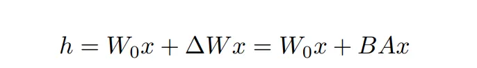
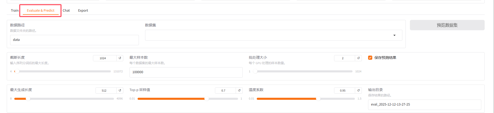
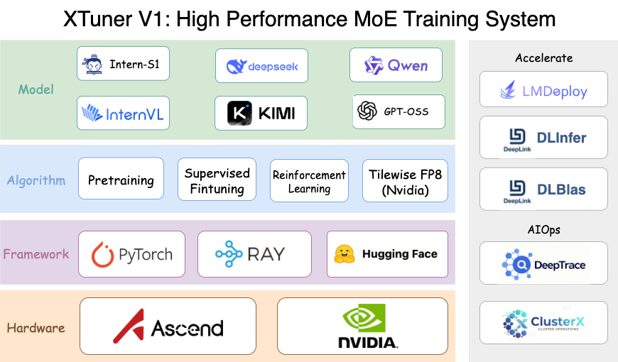
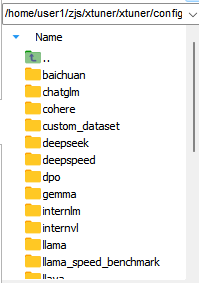

# Lesson 7

> 主要内容：介绍LoRA微调基本原理，llamfactory组件，xtuner微调

## 微调

**微调**：微调是针对特定任务或用例调整[预训练模型](https://www.ibm.com/cn-zh/think/topics/pretrained-model)的过程，把模型的部分能力进行放大，同时想保留大模型的其他能力

**全量微调**：针对模型每个参数进行学习

**全量微调的局限**：模型能力的遗忘

**参数高效微调**（PEFT）：比如LoRA、DoRA等

**LoRA**:Low-Rank Adaptation of Large Language Models

> 论文：[Click](https://arxiv.org/pdf/2106.09685v1)

## LoRA

### LoRA微调的基本原理

#### 低秩适应（Low-Rank Adaptation）：

冻结原始大模型参数，仅训练新增的**低秩矩阵**，大幅度减少需要修改的参数；

#### 公式表达：



$W_0$ 表示微调前的的原始权重，微调后的权重为 $W_0 + \Delta W$ ; $\Delta W$ 才是真正被更新的权重部分。

假设 $\Delta W $ 的权重为m * n，可以将其转换为BA ，其中B形状为m * k,A的形状为k * n;k就是低秩矩阵的秩。由此可见，在参数m、n很大时，只要k取合适的小值，就能大幅度减少需要微调的参数。

e.g. 


#### 为什么高效？

- 参数效率：仅训练0.1%~1%的参数量
- 内存友好：梯度只计算小矩阵，显存占用降低3~5倍
- 即插即用：训练后的LoRA权重可独立保存（ adapter_model.bin ），动态加载到原模型。

> 适用场景：角色扮演，领域知识注入等轻量化微调

#### 实现的步骤

1. 冻结预训练模型的原始权重
2. 为每个需要微调的权重矩阵W添加低秩矩阵对B和A
3. 仅训练这些低秩矩阵
4. 推理时将ΔW与原始权重W相加

## LLaMA Factory

[github地址](https://github.com/hiyouga/LLaMA-Factory)    [文档](https://llamafactory.readthedocs.io/zh-cn/latest/index.html)

### 核心功能

- **统一框架**：支持**LLaMA/Qwen/Baichuan/ChatGLM** 等100+模型；
- **高效训练**：集成 **LoRA/QLoRA/全参数微调**，支持**多GPU、DeepSpeed**；
- **零编码**：提供可视化Web UI，无需写代码即可启动训练；

### 环境构建

```powershell
git clone --depth 1 https://github.com/hiyouga/LLaMA-Factory.git
cd LLaMA-Factory
pip install -e ".[torch,metrics]"
```

如果有更多需求，安装对应依赖,适用于不同的使用需求:

| torch        | 开源深度学习框架 PyTorch，广泛用于机器学习和人工智能研究中。 |
| ------------ | :----------------------------------------------------------: |
| torch-npu    |                  PyTorch 的昇腾设备兼容包。                  |
| metrics      |               用于评估和监控机器学习模型性能。               |
| deepspeed    |             提供了分布式训练所需的零冗余优化器。             |
| bitsandbytes |                    用于大型语言模型量化。                    |
| hqq          |                    用于大型语言模型量化。                    |
| eetq         |                    用于大型语言模型量化。                    |
| gptq         |                   用于加载 GPTQ 量化模型。                   |
| awq          |                   用于加载 AWQ 量化模型。                    |
| aqlm         |                   用于加载 AQLM 量化模型。                   |
| vllm         |                提供了高速并发的模型推理服务。                |
| galore       |                   提供了高效全参微调算法。                   |
| badam        |                   提供了高效全参微调算法。                   |
| qwen         |              提供了加载 Qwen v1 模型所需的包。               |
| modelscope   |        魔搭社区，提供了预训练模型和数据集的下载途径。        |
| swanlab      |      开源训练跟踪工具 SwanLab，用于记录与可视化训练过程      |
| dev          |                用于 LLaMA Factory 开发维护。                 |

### Web UI

#### 启动Web界面

```powershell
#运行Web UI
llamafactory-cli webui 

#让程序只使用物理 GPU0，其它 GPU 对程序不可见
set CUDA_VISIBLE_DEVICES=0 

#启动 WebUI 的公网共享访问功能。
set GRADIO_SHARE=1 

#指定 WebUI 使用的端口号为 7860
set GRADIO_SERVER_PORT=7860 

set CUDA_VISIBLE_DEVICES=0 && set GRADIO_SHARE=1 && set GRADIO_SERVER_PORT=7860 && llamafactory-cli webui
```

如果是在服务器上使用web ui ，需要本地用 SSH 端口转发访问服务器的 WebUI：

> 针对连接服务器使用web ui的情况

```powershell
ssh -L 7860:127.0.0.1:7860 -p port username@remotehost
```

#### 界面配置关键参数

- **Model Path**：输入模型路径（如 Qwen/Qwen2.5-7B-Instruct ）
- **Dataset** → 选择你的数据集（自定义的数据集需提前按格式注册到 dataset_info.json ）
- **Fine-tuning Method** → 选择 LoRA
- **Quantization** → 显存不足时开启QLoRA（如4-bit）
- **Training Args** → 设置学习率、批次大小、训练轮数（ epochs=3 ）
- **Preview Command** → 自动生成等效命令，可复制备用

### 训练启动方法

#### 1.Web UI

在界面配置好关键的参数，直接点击“开始”便可进行训练；

#### 2.使用YAML配置文件（适合批量训练）

- 复制模板并修改：

```powershell
cp examples/train_lora/llama3_lora_sft.yaml configs/qwen2_lora.yaml
```

- 编辑YAML内容：

```yaml
model_name_or_path: Qwen/Qwen2.5-7B-Instruct
dataset_dir: data
dataset: your_dataset_name  # 需在dataset_info.json中注册
finetuning_type: lora
template: qwen
output_dir: saves/qwen2-7b-lora
per_device_train_batch_size: 2
gradient_accumulation_steps: 8
learning_rate: 2e-5
num_train_epochs: 3
lora_rank: 64
quantization_bit: 4  # 开启4-bit QLoRA
```

- 启动训练

```powershell
llamafactory-cli train configs/qwen2_lora.yaml
```

#### 3.命令行直接指定参数（灵活但需要命令完整）

```powershell
CUDA_VISIBLE_DEVICES=0 llamafactory-cli train \
  --stage sft \
  --model_name_or_path Qwen/Qwen2.5-7B-Instruct \
  --dataset your_dataset_name \
  --template qwen \
  --finetuning_type lora \
  --lora_rank 64 \
  --per_device_train_batch_size 2 \
  --gradient_accumulation_steps 8 \
  --learning_rate 2e-5 \
  --num_train_epochs 3 \
  --quantization_bit 4 \
  --output_dir saves/qwen2-7b-lora
```

### 数据集

**数据集的格式：**

- 必须包含 instruction 、 input 、 output 三列（Alpaca格式）
- 在 data/dataset_info.json 中注册数据集（示例）：

```
{
  "medical_qa": {
    "file_name": "data/medical.json",
    "columns": {
      "prompt": "instruction",
      "response": "output"
   }
 }
}
```

### 其他的注意事项

- **路径问题:**

模型路径可为 **HuggingFace ID**（自动下载）或 **本地路径**（如/root/.cache/modelscope/hub/Qwen/Qwen3-14B ）

数据集路径需相对于 LLaMA-Factory/data/ 目录

- **中文乱码修复**：

确保数据集文件编码为 **UTF-8**（Linux检查命令： file -i data/your_data.json ）

训练命令添加 --template qwen 指定中文模板

### 模型效果测试

- 可以直接在Web 界面使用其Evaluate模块的功能，通过看最后的评估值查看模型的效果



- 也可以直接使用chat模块体验模型的变化
- 代码调用微调后的模型进行问答:

```python
from transformers import AutoTokenizer, AutoModelForCausalLM
from peft import PeftModel
import torch

base_model = "Qwen/Qwen2.5-7B-Instruct"   # 微调的模型
lora_path = "saves/qwen2-7b-lora"         # LoRA 权重目录

#加载原始模型
tokenizer = AutoTokenizer.from_pretrained(base_model)
model = AutoModelForCausalLM.from_pretrained(base_model, device_map="auto")

#合并LoRA权重
model = PeftModel.from_pretrained(model, lora_path)

#问答测试
query = "糖尿病人可以吃什么水果？"
prompt = f"用户：{query}\n助手："

inputs = tokenizer(prompt, return_tensors="pt").to(model.device)
output_ids = model.generate(**inputs, max_new_tokens=200)
print(tokenizer.decode(output_ids[0], skip_special_tokens=True))
```

## Xtuner

[github地址](https://github.com/InternLM/xtuner)     [中文文档](https://xtuner.readthedocs.io/zh-cn/latest/index.html#)

### 介绍



**XTuner V1** 是一个专为超大规模 MoE 模型打造的新一代大模型训练引擎。与传统 3D 并行训练架构相比，XTuner V1 针对当前学术界主流的 MoE 训练场景进行了深度优化。

**高效**

仅需 8GB 显存即可微调 7B 模型，支持多节点跨设备微调 70B + 大模型。通过自动分发 FlashAttention、Triton kernels 等高性能算子加速训练，兼容 DeepSpeed，能轻松应用 ZeRO 优化策略提升训练效率。

**灵活**

兼容 InternLM、Llama 2、ChatGLM,QWen,DeepSeek 等多种主流大语言模型和 LLaVA 多模态图文模型，支持预训练与微调。数据管道设计灵活，兼容任意数据格式，支持 QLoRA、LoRA 及全量参数微调等多种算法。

**全能**

支持增量预训练、指令微调与 Agent 微调，提供丰富的开源对话模板便于与模型交互。训练所得模型可无缝接入部署工具库 LMDeploy、评测工具库 OpenCompass 及 VLMEvalKit，实现从训练到部署的全流程支持。

### 安装

**创建虚拟环境**

```
conda create --name xtuner-env python=3.10 -y
conda activate xtuner-env
```

**拉取XTuner**

```powershell
git clone https://github.com/InternLM/xtuner.git
cd xtuner
#-e代表的是可编辑模式进行安装
pip install -e .
#部分内容需要额外指定参数进行安装
```

注意：很多模型会默认加载bitsandbytes，bitsandbytes 需要 GPU + 合适的 CUDA 环境，否则会 fallback 为 CPU 版本或报错。

**验证安装成功与否**

```
# 运行 XTuner 官方提供的最小 SFT 训练 demo，用于测试环境配置是否正常
#跑这个demo可能会有部分缺失的包，若报错手动安装一下即可
torchrun  xtuner/v1/train/cli/sft.py --model-cfg examples/v1/config/sft_qwen3_tiny.py --chat_template qwen3 --dataset tests/resource/openai_sft.jsonl
```

上述日志显示最大仅需 8G 显存即可运行，如果想降低显存占用，可以考虑修改 `examples/v1/config/sft_qwen3_tiny.py` 中的 `num_hidden_layers` 和 `hidden_size` 参数。

### 微调

- 下载模型：

```python
#模型下载
from modelscope import snapshot_download
model_dir = snapshot_download('Qwen/Qwen1.5-1.8B-Chat',cache_dir="/root/autodl-tmp/llm")
```

关于xtuner支持哪些模型，可以直接进入源码的xtuner/xtuner/config进行查看，有相应的模型文件就支持



- 制作数据集

将我们制作好的数据集或者是网上下载的数据集（格式不符合需要进行相应的处理）传到服务器上，我们一般放 XTuner源码data目录里（没有则创建该目录）。

- 配置文件

常用的参数：

（1）大模型名称:pretrained_model_name_or_path

（2）提示词模版：prompt_template

（3）数据集最大长度：max_length

（4）是否检查他的最大长度：pack_to_max_length

（5）优化器相关配置： 

（6）保存的相关配置：

```python
save_steps = 500
save_total_limit = 2  # Maximum checkpoints to keep 
```

（7）验证测试：

```python
evaluation_freq = 500
SYSTEM = SYSTEM_TEMPLATE.alpaca
evaluation_inputs = ["请给我介绍五个上海的景点", "Please tell me five scenic spots in Shanghai"]
```

（8）LoRA 配置

```python
model = dict(   # 构建 model
	type=SupervisedFinetune,   # 指令跟随微调    	
	use_varlen_attn=use_varlen_attn,
    llm=dict( # LLM        
        type=AutoModelForCausalLM.from_pretrained,
        pretrained_model_name_or_path=pretrained_model_name_or_path, 
        trust_remote_code=True,
        torch_dtype=torch.float16, 
        quantization_config=dict(  # 量化配置 
            type=BitsAndBytesConfig, 
            load_in_4bit=True,    
            load_in_8bit=False,     
            llm_int8_threshold=6.0,            		
            llm_int8_has_fp16_weight=False,            
            bnb_4bit_compute_dtype=torch.float16,            
            bnb_4bit_use_double_quant=True,            
            bnb_4bit_quant_type="nf4",
        ),    
    ),    
    lora=dict(   # LoRA 配置
        type=LoraConfig,        
        r=64,        
        lora_alpha=16,        
        lora_dropout=0.1,        
        bias="none",       
        task_type="CAUSAL_LM",   
    ),
)
```

若不需要启动QLoRA则对应部分需要注释掉


创建微调训练相关的配置文件在左侧的文件列表，xtuner 的文件夹里，打开xtuner/xtuner/configs/internlm/internlm2_chat_1_8b/internlm2_chat_1_8b_qlora_alpaca_e3.py，

复制一份至根目录。

打开这个文件，然后修改预训练模型地址，数据文件地址等。

```python
### PART 1中
#预训练模型存放的位置
pretrained_model_name_or_path = '/root/llm/internlm2-1.8b-chat'#基座模型路径
#微调数据存放的位置
data_files = '/root/public/data/target_data.json'

# 训练中最大的文本长度
max_length = 512
# 每一批训练样本的大小
batch_size = 2
#最大训练轮数
max_epochs = 3
#验证数据
evaluation_inputs = [
    '只剩一个心脏了还能活吗？', '爸爸再婚，我是不是就有了个新娘？',
    '樟脑丸是我吃过最难吃的硬糖有奇怪的味道怎么还有人买','马上要上游泳课了，昨天洗的泳裤还没
干，怎么办',
    '我只出生了一次，为什么每年都要庆生'
]
# PART 3中
dataset=dict(type=load_dataset, path="json",data_files=data_files)
dataset_map_fn=None
```

- 微调训练

在当前目录下，输入以下命令启动微调脚本

```powershell
#单卡微调
xtuner train internlm2_chat_1_8b_qlora_alpaca_e3.py
#多卡微调
#XTuner 会自动调用：
#torch.distributed
#DeepSpeed
#ZeRO 优化器 来进行分布式微调
NPROC_PER_NODE=2 xtuner train /home/cw/utils/xtuner-main/qwen1_5_1_8b_chat_qlora_alpaca_e3.py --deepspeed deepspeed_zero2

#多卡指定显卡微调
CUDA_VISIBLE_DEVICES=0,2 NPROC_PER_NODE=2 xtuner train /home/cw/utils/xtuner-main/qwen1_5_1_8b_chat_qlora_alpaca_e3.py --deepspeed deepspeed_zero2
```

- 模型转换

模型训练后会自动保存成 PTH 模型（例如 iter_2000.pth ，如果使用了 DeepSpeed，则将会是一个文件夹），我们需要利用 xtuner convert pth_to_hf 将其转换为 HuggingFace 模型，以便于后续使用。具体命令为：

```
xtuner convert pth_to_hf ${FINETUNE_CFG} ${PTH_PATH} ${SAVE_PATH}

# 例如：xtuner convert pth_to_hf internlm2_chat_7b_qlora_custom_sft_e1_copy.py  ./iter_2000.pth ./iter_2000_
```

- 模型的合并

如果使用了 LoRA / QLoRA 微调，则模型转换后将得到 adapter 参数，而并不包含原 LLM参数。如果期望获得合并后的模型权重（例如用于后续评测），那么可以利用 xtuner convert merge ：

```
$ xtuner convert merge ${LLM} ${LLM_ADAPTER} ${SAVE_PATH}
```

## 作业

### L1

跑通llamafactory的微调流程，自己微调一个模型（选型，大小，数据集皆不限），传个能展示效果的图就行

### L2

跑通xtuner的微调流程，也微调一个模型，要求同上

**邮箱**：pine721@outlook.com

**附上学号姓名**

